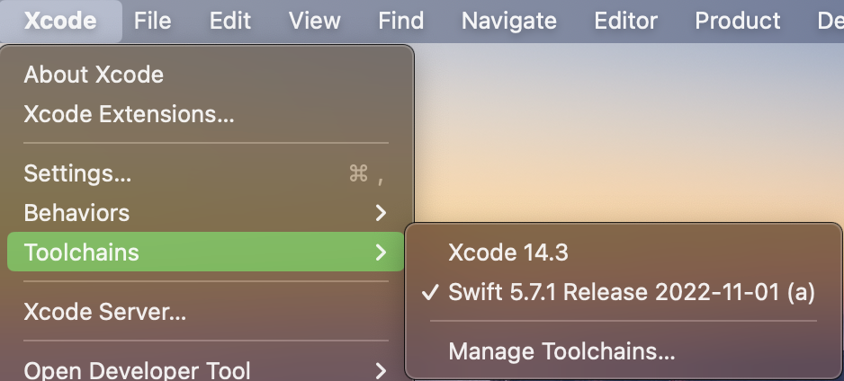

# HelloSwift
[TOC]

## 1、Swift基本语法

### (1) 第一个HelloWorld程序

```swift
print("Hello, World!")
```

Swift程序的入口，可以没有main函数，而且每个语句可以没有分号。

官方文档描述[^1]，如下

> Code written at global scope is used as the entry point for the program, so you don’t need a `main()` function. You also don’t need to write semicolons at the end of every statement.


#### a. 注释

Swift中的注释使用`//`和`/**/`，但是`/**/`支持注释嵌套。举个例子，如下

```swift
/* This is the start of the first multiline comment.
 /* This is the second, nested multiline comment. */
This is the end of the first multiline comment. */
```


#### b. 分号

每个语句后面的分号是可选的。但是如果多个语句在一行，则用分号来分隔。

举个例子，如下

```swift
let cat = "🐱"; print(cat)
// Prints "🐱"
```


### (2) 定义变量

#### a. var和let

Swift中使用var和let定义变量

* 值会后续被修改，使用var
* 值是常量不会被修改，使用let

示例代码，如下

```swift
var myVariable = 42
myVariable = 50
let myConstant = 42
```


变量名可以包含Unicode字符[^2]。举个例子，如下

```swift
let π = 3.14159
let 你好 = "你好世界"
let 🐶🐮 = "dogcow"
```

但是不能包含空白符、数学符号、箭头、私有Unicode字符等，不能以数字开头。

官方文档描述，如下

> Constant and variable names can’t contain whitespace characters, mathematical symbols, arrows, private-use Unicode scalar values, or line- and box-drawing characters. Nor can they begin with a number, although numbers may be included elsewhere within the name.

一旦定义好变量名和类型，就不能修改类型或者切换为constant/variable。

如果变量名要使用Swift的关键词，则可以使用<code>`</code>来包住这个变量名。但是不推荐使用。

官方文档描述，如下

> If you need to give a constant or variable the same name as a reserved Swift keyword, surround the keyword with backticks (`) when using it as a name. However, avoid using keywords as names unless you have absolutely no choice.

举个例子，如下

```swift
func test_variable_name_use_keyword() throws {
    let `var`: String = "Use keyword as variable name"
    print(`var`)
}
```


#### b. 变量类型

Swift中定义变量，如果初始化有值，可以不用写类型，编译器会根据初始化值的类型，推断变量的类型。

官方文档描述[^12]，如下

> It’s rare that you need to write type annotations in practice. If you provide an initial value for a constant or variable at the point that it’s defined, Swift can almost always infer the type to be used for that constant or variable, as described in [Type Safety and Type Inference](https://docs.swift.org/swift-book/documentation/the-swift-programming-language/thebasics#Type-Safety-and-Type-Inference).

示例代码，如下

```swift
let implicitInteger = 70
let implicitDouble = 70.0
let explicitDouble: Double = 70
```

* implicitInteger被隐式推断为Integer
* implicitDouble被隐式推断为Double
* explicitDouble显示定义为Double

注意

> 变量之间的类型转换，在Swift中是不支持隐式转换的。需要明确显式转换。举个例子，如下
>
> ```swift
> let label = "The width is "
> let width = 94
> let widthLabel = label + String(width)
> ```
>
> 这里width变量必须转成String类型，才能做字符串拼接

定义变量，标记变量类型，也称为**类型注解**(Type Annotation)。

如果要声明多个变量，可以使用逗号分隔。举个例子，如下

```swift
var red, green, blue: Double
```


#### c. 可选变量

在变量类型后面，跟着一个`?`，表示这个变量是可能为nil的

举个例子，如下

```swift
var optionalString: String? = "Hello"
print(optionalString == nil)
```


当一个变量是对象，而且这个变量定义为可选。那么这个对象的属性，即使不是可选，获取的变量也是一个可选变量。

举个例子，如下

```swift
let optionalSquare: Square? = Square(sideLength: 2.5, name: "optional square")
let sideLength = optionalSquare?.sideLength
```

这里sideLength将是一个可选变量。即使sideLength属性在Square类中定义不是可选的。


### (3) 数据类型

#### a. 整型(Integer)

Integer是没有分数部分的，分为有符号(正数、0和负数)和无符号(正数和0)两种

Swift提供8、16、32和64位形式的整数。例如UInt8、Int32类型等。

整型类型有min和max两个属性。举个例子，如下

```swift
let minValue = UInt8.min  // minValue is equal to 0, and is of type UInt8
let maxValue = UInt8.max  // maxValue is equal to 255, and is of type UInt8
```


##### Int

大多数情况下，代码中可以不用指定特定整型类型，而是使用Int类型。

* 在32位平台上，Int和Int32是等价的
* 在64位平台上，Int和Int64是等价的


##### UInt

和Int类型一样。UInt类型也是平台相关的。

* 在32位平台上，UInt和UInt32是等价的
* 在64位平台上，UInt和UInt64是等价的


#### b. 浮点数(Float)

浮点数是带分数部分的数字。在Swift中提供2种浮点类型

* Double类型，代表64位浮点数
* Float类型，代表32位浮点数

说明

> Double类型至少有小数点后15位的精度，Float类型有小数点后6位的精度。选取哪种类型，取决于代码中使用的场景和需要。如果两种都适合，优先使用Double类型。


#### c. 类型安全(Type Safety)和类型推断(Type Inference)

Swift是类型安全的语言，这个意味着变量类型定义好后，不能赋值给它其他类型的值。这个错误会在编译期检查出来。即使在变量定义时没有显示声明类型，编译器会根据初始化值的类型，进行类型推断，判断出变量的类型。

一般来说，

* 整型数字，会推断为Int
* 浮点数字，会推断为Double

* 整型数字和浮点数字，进行算术运算，也会推断为Double

举个例子，如下

```swift
let meaningOfLife = 42
// meaningOfLife is inferred to be of type Int

let pi = 3.14159
// pi is inferred to be of type Double

let anotherPi = 3 + 0.14159
// anotherPi is also inferred to be of type Double
```


#### d. 数字字面量(Numeric Literals)

数字字面量，有下面几种

* 十进制数字，没有前缀
* 二进制数字，有0b前缀
* 八进制数字，有0o前缀
* 十六进制数字，有0x前缀

举个例子，如下

```swift
let decimalInteger = 17
let binaryInteger = 0b10001       // 17 in binary notation
let octalInteger = 0o21           // 17 in octal notation
let hexadecimalInteger = 0x11     // 17 in hexadecimal notation
```

说明

> 浮点数字面量，可以是十进制或者十六进制


十进制的浮点数，可以有指数形式，用大写或小写的e

举个例子，如下

- `1.25e2` means 1.25 * 10^2, or `125.0`.
- `1.25e-2` means 1.25 * 10^-2, or `0.0125`.


十六进制的浮点数的指数形式，用大写或小写的p

举个例子，如下

- `0xFp2` means 15 * 2^2, or `60.0`.
- `0xFp-2` means 15 * 2^-2, or `3.75`.


举个例子，下面表示都是十进制`12.1875`

```swift
let decimalDouble = 12.1875
let exponentDouble = 1.21875e1
let hexadecimalDouble = 0xC.3p0
```


数字字面量(Numeric Literals)，可以使用padding zero和下划线来增加可读性。

举个例子，如下

```swift
let paddedDouble = 000123.456
let oneMillion = 1_000_000
let justOverOneMillion = 1_000_000.000_000_1
```


#### e. 数字类型转换

数字类型转换，包含不同类型的数字转成其他类型的。

##### 整型类型转换

整型类型都有特定的值范围，需要case-by-case来决定转换的类型。举个例子，如下

```swift
let twoThousand: UInt16 = 2_000
let one: UInt8 = 1
let twoThousandAndOne = twoThousand + UInt16(one)
```

通过`SomeType(ofInitialValue)`来初始化一个新类型的对象。这里将one变量的UInt8转成UInt16，保证+号的左右操作数的类型是一致的。


##### 整型和浮点数之间的转换

整型和浮点数之间的转换，必须显式转换

举个例子，如下

```swift
let three = 3
let pointOneFourOneFiveNine = 0.14159
let pi = Double(three) + pointOneFourOneFiveNine
// pi equals 3.14159, and is inferred to be of type Double
```

另外，浮点数也可以转成整型。举个例子，如下

```swift
let integerPi = Int(pi)
// integerPi equals 3, and is inferred to be of type Int
```

这里转换是取浮点数的整数部分，例如`4.75` 变成 `4`、  `-3.9`变成 `-3`


#### f. 布尔类型(Bool)

Swift中的布尔类型，是Bool，提供true和false两个常量。

举个例子，如下

```swift
let orangesAreOrange = true
let turnipsAreDelicious = false
```

上面2个变量，被编译器会推断为Bool类型。

在Swift中非布尔值不能替代布尔类型。

举个例子，如下

```swift
let i = 1
if i {
    // this example will not compile, and will report an error
}
```

正确写法，如下

```swift
let i = 1
if i == 1 {
    // this example will compile successfully
}
```

这里i == 1的结果是Bool类型


#### g. 元组类型(Tuple)

元组类型(Tuple)，将多个值组合成一个复合的单值。元组中的每个值的类型可以都相同，或者不同。

举个例子，如下

```swift
let http404Error = (404, "Not Found")
// http404Error is of type (Int, String), and equals (404, "Not Found")
```

上面http404Error的类型，可以描述为，类型为(Int, String)的元组。

获取分组的元素，有下面几种方式

* 分解方式
* 下标方式
* 名字引用方式


##### 分解方式

分解一个元组，举个例子，如下

```swift
let (statusCode, statusMessage) = http404Error
print("The status code is \(statusCode)")
// Prints "The status code is 404"
print("The status message is \(statusMessage)")
// Prints "The status message is Not Found"
```

如果不需要元组中的某个值，则使用`_`。举个例子，如下

```swift
let (justTheStatusCode, _) = http404Error
print("The status code is \(justTheStatusCode)")
// Prints "The status code is 404"
```


##### 下标方式

按照下标来访问元组变量中的特定元素。举个例子，如下

```swift
print("The status code is \(http404Error.0)")
// Prints "The status code is 404"
print("The status message is \(http404Error.1)")
// Prints "The status message is Not Found"
```


##### 名字引用方式

如果元组定义时，使用名字，则引用某个元素，也可以使用名字。举个例子，如下

```swift
let http200Status = (statusCode: 200, description: "OK")

print("The status code is \(http200Status.statusCode)")
// Prints "The status code is 200"
print("The status message is \(http200Status.description)")
// Prints "The status message is OK"
```


说明

> 元组适合简单将几个值组合在一起。对于复杂的数据结构，建议使用结构体和类，而不是使用元组。


#### h. 可选类型 (Optional)

可选类型，代表值的两种情况

* 值存在，可以unwrap可选类型获取这个值
* 值不存在

说明

> 可选类型的概念，在C和Objective-C不存在。在Objective-C中接近这个概念的是某个方法返回nil，但是nil不适用于基本类型。如果枚举类型要返回nil，则需要定义一个缺省的枚举类型，在Swift中任何类型都可以定义为可选类型。

举个例子，如下

```swift
let possibleNumber = "123"
let convertedNumber = Int(possibleNumber)
// convertedNumber is inferred to be of type "Int?", or "optional Int"
```

这里Int的初始化函数，实际签名，如下

```swift
init?(_ description: String)
```

可以将字符串转成整型。但是不是所有字符串都可以转成整型，因此Int的初始化函数的返回值类型，是可选类型。convertedNumber也被推断为可选类型。


##### nil

可以设置可选类型变量一个特殊值，即nil

举个例子，如下

```swift
var serverResponseCode: Int? = 404
// serverResponseCode contains an actual Int value of 404
serverResponseCode = nil
// serverResponseCode now contains no value

var surveyAnswer: String?
// surveyAnswer is automatically set to nil
```

nil不能和非可选类型一起使用。如果定义可选类型变量没有赋值，则编译器默认会赋值这个可选变量的值为nil。

说明

> Swift中nil和Objective-C中nil不一样。Objective-C的nil，是指向不存在对象的指针。而Swift中nil不是指针，而是可选类型的特定值，代表值不存在。


在if语句中可以使用`==`或`!=`来和nil比较，用于判断可选变量是否有值。

举个例子，如下

```swift
if convertedNumber != nil {
    print("convertedNumber contains some integer value.")
}
// Prints "convertedNumber contains some integer value."

if convertedNumber != nil {
    print("convertedNumber has an integer value of \(convertedNumber!).")
}
// Prints "convertedNumber has an integer value of 123."
```

这里使用`!`来unwrap可选变量。

注意

> 使用`!`来unwrap可选变量，一定要保证变量值是非nil，否则在运行时会产生一个异常error


##### 可选变量绑定 (Optional Binding)

可选变量绑定 (Optional Binding)的含义是，判断可选变量是否有值，如果有值，则赋值给一个临时变量。

官方文档描述，如下

> You use *optional binding* to find out whether an optional contains a value, and if so, to make that value available as a temporary constant or variable. Optional binding can be used with `if` and `while` statements to check for a value inside an optional, and to extract that value into a constant or variable, as part of a single action.

可选变量绑定，一般用于if和while语句中。

举个例子，如下

```swift
if let actualNumber = Int(possibleNumber) {
    print("The string \"\(possibleNumber)\" has an integer value of \(actualNumber)")
} else {
    print("The string \"\(possibleNumber)\" couldn't be converted to an integer")
}
// Prints "The string "123" has an integer value of 123"
```

这里使用常量actualNumber去绑定可选变量。也可以使用变量来绑定。举个例子，如下

```swift
if var actualNumber = Int(possibleNumber) {
    actualNumber = 456

    print("The string \"\(possibleNumber)\" has an integer value of \(actualNumber)")
} else {
    print("The string \"\(possibleNumber)\" couldn't be converted to an integer")
}
```


在if语句中，可选变量绑定，还可以条件判断组合在一起，用逗号分隔这些条件。如果可选变量绑定为nil，或者条件判断为false，则if语句的整个条件为false。

举个例子，如下

```swift
if let firstNumber = Int("4"), let secondNumber = Int("42"), firstNumber < secondNumber && secondNumber < 100 {
    print("\(firstNumber) < \(secondNumber) < 100")
}
// Prints "4 < 42 < 100"

if let firstNumber = Int("4") {
    if let secondNumber = Int("42") {
        if firstNumber < secondNumber && secondNumber < 100 {
            print("\(firstNumber) < \(secondNumber) < 100")
        }
    }
}
// Prints "4 < 42 < 100"
```

另外，if语句有多个条件时，采用短路原则。遇到某个可选变量绑定为nil，或者条件为false，则余下的条件不会继续执行。举个例子，如下

```swift
func test_multiple_optional_binding_shorthand() throws {
    if let firstNumber = Int("helloWorld"), let secondNumber = getNumber(), firstNumber < secondNumber && secondNumber < 100 {
        print("\(firstNumber) < \(secondNumber) < 100")
    }
}

func getNumber() -> Int? {
    print("getNumber called")
    return 42
}
```

说明

> 和if-let组合类似，还有guard语句。


##### 隐式Unwrapped可选变量(Implicitly Unwrapped Optionals)

Implicitly Unwrapped Optionals的含义是，某些情况下，可选变量总是有值的，那么移除每次检查可选变量是非常有用的。这些总是有值的可选变量就称为Implicitly Unwrapped Optionals。

官方文档描述[^2]，如下

> Sometimes it’s clear from a program’s structure that an optional will *always* have a value, after that value is first set. In these cases, it’s useful to remove the need to check and unwrap the optional’s value every time it’s accessed, because it can be safely assumed to have a value all of the time.
>
> These kinds of optionals are defined as *implicitly unwrapped optionals*.

举个例子，如下

```swift
let possibleString: String? = "An optional string."
let forcedString: String = possibleString! // requires an exclamation point

let assumedString: String! = "An implicitly unwrapped optional string."
let implicitString: String = assumedString // no need for an exclamation point

let optionalString = assumedString
// The type of optionalString is "String?" and assumedString isn't force-unwrapped.

if assumedString != nil {
    print(assumedString!)
}
// Prints "An implicitly unwrapped optional string."

if let definiteString = assumedString {
    print(definiteString)
}
// Prints "An implicitly unwrapped optional string."
```

上面assumedString变量是一个隐式Unwrapped可选变量，对于这种特殊的可选变量，可以按照可选变量来处理，比如和nil比较，使用if-let绑定可选变量等


### (4) 基本操作符(Basic Operators)

TODO: https://docs.swift.org/swift-book/documentation/the-swift-programming-language/basicoperators


### (5) 字符串(Strings and Characters)

#### a. String interpolation

使用`\()`进行字符串插入变量值。举个例子，如下

```swift
let apples = 3
let oranges = 5
let appleSummary = "I have \(apples) apples."
let fruitSummary = "I have \(apples + oranges) pieces of fruit."
```

`\()`的括号，可以放入代码进行计算。


#### b. 多行字符串

使用三个引号`"""`，实现多行字符串。举个例子，如下

```swift
let quotation = """
I said "I have \(apples) apples."
And then I said "I have \(apples + oranges) pieces of fruit."
"""
```

说明

> 三个引号`"""`中，允许单个`"`


### (6) 容器类型(Collection Types)

容器类型(Array/Dictionary/Set)

Array和Dictionary都可以使用`[]`来定义，访问每个元素，使用下标index或者key。

举个例子，如下

```swift
var shoppingList = ["catfish", "water", "tulips"]
shoppingList[1] = "bottle of water"

var occupations = [
    "Malcolm": "Captain",
    "Kaylee": "Mechanic",
]
occupations["Jayne"] = "Public Relations"
```

说明

> Array和Dictionary定义，允许最后一个元素跟着一个逗号


创建一个空的Array或者Dictionary，如下

```swift
let emptyArray: [String] = []
let emptyDictionary: [String: Float] = [:]
```

如果要赋值一个空的Array或者Dictionary，如下

```swift
shoppingList = []
occupations = [:]
```


### (7) 控制流(Control Flow)

 Swift支持的控制流语句，如下

* 条件语句
  * if
  * switch

* 循环语句
  * for-in
  * while
  * repeat-while

控制流语句的条件或者循环变量的括号是可以省略的。语句的body需要括号，这个不能省略。

举个例子，如下

```swift
let individualScores = [75, 43, 103, 87, 12]
var teamScore = 0
for score in individualScores {
    if score > 50 {
        teamScore += 3
    } else {
        teamScore += 1
    }
}
print(teamScore)
```

这里for语句和if语句都省略了括号

注意

> if语句的条件，必须是一个Boolean表达式。如果写成if score { ... }，则编译器会报错，编译器不支持隐式和0做比较。


#### a. if-let语句

if和let可以组成if-let语句，它完成2个事情：if语句中的局部变量赋值，和判断这个局部变量是否nil。

举个例子，如下

```swift
var optionalName: String? = "John Appleseed"
var greeting = "Hello!"
if let name = optionalName {
    greeting = "Hello, \(name)"
}
```

这里如果name为nil，则if语句不执行。


#### b. `??`操作符

和if-let语句的作用类似，`??`操作符为可选变量提供一个默认值。

举个例子，如下

```swift
let nickname: String? = nil
let fullName: String = "John Appleseed"
let informalGreeting = "Hi \(nickname ?? fullName)"
```

这里如果nickname不为nil，则`informalGreeting = "Hi \(nickname)"`；为nil，则`informalGreeting = "Hi \(fullName)"`


#### c. switch语句

Swift中switch语句支持更多case条件的比较，以及自定义case条件。

举个例子，如下

```swift
let vegetable = "red pepper"
switch vegetable {
case "celery":
    print("Add some raisins and make ants on a log.")
case "cucumber", "watercress":
    print("That would make a good tea sandwich.")
case let x where x.hasSuffix("pepper"):
    print("Is it a spicy \(x)?")
default:
    print("Everything tastes good in soup.")
}
// Prints "Is it a spicy red pepper?"
```

这里第三个case属于自定义case条件。

说明

> Swift中switch语句的case中不用使用break


#### d. for-in语句

for-in语句在对Dictionary遍历时，需要提供key-value形式的2个变量。举个例子，如下

```swift
let interestingNumbers = [
    "Prime": [2, 3, 5, 7, 11, 13],
    "Fibonacci": [1, 1, 2, 3, 5, 8],
    "Square": [1, 4, 9, 16, 25],
]
var largest = 0
for (_, numbers) in interestingNumbers {
    for number in numbers {
        if number > largest {
            largest = number
        }
    }
}
print(largest)
// Prints "25"
```

这里`_`符号起到站位的作用，代表interestingNumbers的每个key，而numbers代表interestingNumbers的每个value。


for-in语句，如果按照下标范围变量，则使用`..<`定义一个范围。举个例子，如下

```swift
var total = 0
for i in 0..<4 {
    total += i
}
print(total)
// Prints "6"
```

说明

> `..<`，创建一个左闭右开的区间，即[a, b)
>
> `...`，创建一个左闭右闭的区间，即[a, b]


#### e. while语句和repeat-while语句

举个例子，如下

```swift
var n = 2
while n < 100 {
    n *= 2
}
print(n)
// Prints "128"

var m = 2
repeat {
    m *= 2
} while m < 100
print(m)
// Prints "128"
```


### (8) 函数(Functions)

在Swift中使用`func`声明一个函数，如果函数有返回值，则使用`-> ReturnType`来声明返回值类型。

举个例子，如下

```swift
func greet(person: String, day: String) -> String {
    return "Hello \(person), today is \(day)."
}
greet(person: "Bob", day: "Tuesday")
```

定义函数的参数列表，默认使用变量名作为它的标号(label)。上面greet函数的参数有person和day这2个label。label是函数签名的一部分，例如greet函数的签名是`greet(persion:day:)`。将标号和形参区分的好处是调用函数时，方便代码自解释，同时函数签名不和形参名绑定。

注意

> label也是函数签名的一部分。按照label传实参的顺序不能乱。比如greet(day: "Tuesday", person: "Bob")，则编译器会报错。


当然形参可以没有label，或者取另外一个名字。举个例子，如下

```swift
func greet(_ person: String, on day: String) -> String {
    return "Hello \(person), today is \(day)."
}
greet("John", on: "Wednesday")
```

第一个形参person，它没有标号，使用`_`占位。

第二个形参day，它不实用默认标号，重新定义它的标号为on

这里的greet函数的签名是`greet(_:on:)`，和上面`greet(persion:day:)`是两个不同函数

说明

> ```swift
> func greet(person: String, day: String) -> String {
>     return "Hello \(person), today is \(day)."
> }
> 
> func greet(_ person: String, on day: String) -> String {
>     return "Hello \(person), today is \(day)."
> }
> ```
>
> 上面2个函数是不同的函数签名，分别是`greet(person:day:)`和`greet(_:on:)`，因此上面2个函数可以同时定义，编译器不会报错符号冲突。


#### a. 返回多个值

Swift中使用Tuple来返回多个值。举个例子，如下

```swift
func calculateStatistics(scores: [Int]) -> (min: Int, max: Int, sum: Int) {
    var min = scores[0]
    var max = scores[0]
    var sum = 0

    for score in scores {
        if score > max {
            max = score
        } else if score < min {
            min = score
        }
        sum += score
    }

    return (min, max, sum)
}
let statistics = calculateStatistics(scores: [5, 3, 100, 3, 9])
print(statistics.sum)
// Prints "120"
print(statistics.2)
// Prints "120"
```

上面拿到返回值赋值给statistics变量，通过名字或者序号都可以访问Tuple中的特定元素。


#### b. 隐式返回值

Swift函数可以不使用return语句，根据函数体中最后一个表达式的值作为返回值。

举个例子，如下

```swift
func greeting(for person: String) -> String {
    "Hello, " + person + "!"
}
print(greeting(for: "Dave"))
// Prints "Hello, Dave!"

func anotherGreeting(for person: String) -> String {
    return "Hello, " + person + "!"
}
print(anotherGreeting(for: "Dave"))
// Prints "Hello, Dave!"
```

上面greet函数，没有return语句，直接使用字符串`"Hello, " + person + "!"`作为返回值

注意

> 如果函数体最后一个表达式，无法评估出值，例如
>
> ```swift
> func greeting(for person: String) -> String {
>     print("Hello, " + person + "!")
> }
> ```
>
> 这种情况，编译器会编译报错


#### c. 函数作为返回值

Swift中允许函数作为返回值。

举个例子，如下

```swift
func makeIncrementer() -> ((Int) -> Int) {
    func addOne(number: Int) -> Int {
        return 1 + number
    }
    return addOne
}
var increment = makeIncrementer()
increment(7)
```

函数作为返回值赋值给变量，这个变量类似Objective-C的block变量，可以使用这个变量来调用函数。


#### d. 默认参数

Swift函数的形参可以设置默认值，在调用函数可以省略传入实参，改用默认值。

举个例子，如下

```swift
func defaultParametersBehind(parameterWithoutDefault: Int, parameterWithDefault: Int = 12) {
    // If you omit the second argument when calling this function, then
    // the value of parameterWithDefault is 12 inside the function body.
}

func defaultParametersAhead(parameterWithDefault: Int = 12, parameterWithoutDefault: Int) {
    // If you omit the second argument when calling this function, then
    // the value of parameterWithDefault is 12 inside the function body.
}

func test_default_parameter() throws {
    defaultParametersBehind(parameterWithoutDefault: 3, parameterWithDefault: 6) // parameterWithDefault is 6
    defaultParametersBehind(parameterWithoutDefault: 4) // parameterWithDefault is 12

    defaultParametersAhead(parameterWithoutDefault: 5)
    defaultParametersAhead(parameterWithDefault: 6, parameterWithoutDefault: 5)
}
```

理论上，默认参数可以在参数列表的任意位置，调用函数时编译按照实参顺序，和函数的形参一一做匹配。

但是官方文档推荐，总是把默认参数放在非默认参数后面，方便函数调用时的传参。

官方文档描述[^14]，如下

> Place parameters that don’t have default values at the beginning of a function’s parameter list, before the parameters that have default values. Parameters that don’t have default values are usually more important to the function’s meaning — writing them first makes it easier to recognize that the same function is being called, regardless of whether any default parameters are omitted.


#### e. 可变参数(Variadic Parameters)

在Swift中使用`...`标记可变参数，它用于形参的类型后面，表示接受这个类型的参数，有0个或者多个。

官方文档描述[^14]，如下

> A variadic parameter accepts zero or more values of a specified type. You use a variadic parameter to specify that the parameter can be passed a varying number of input values when the function is called. Write variadic parameters by inserting three period characters (`...`) after the parameter’s type name.

举个例子，如下

```swift
func arithmeticMean(_ numbers: Double...) -> Double {
    var total: Double = 0
    for number in numbers {
        total += number
    }
    return total / Double(numbers.count)
}
arithmeticMean(1, 2, 3, 4, 5)
// returns 3.0, which is the arithmetic mean of these five numbers
arithmeticMean(3, 8.25, 18.75)
// returns 10.0, which is the arithmetic mean of these three numbers
arithmeticMean()
// return NAN
```

上面numbers参数是一个可变参数，在函数体中numbers会转成[Double]类型，是个数组。

说明

> 函数的形参可以有多个可变参数，但是可变参数后面的第一个参数，必须要求有标号，防止可变参数传入多个参数导致调用存在歧义。
>
> 官方文档描述[^14]，如下
>
> > A function can have multiple variadic parameters. The first parameter that comes after a variadic parameter must have an argument label. The argument label makes it unambiguous which arguments are passed to the variadic parameter and which arguments are passed to the parameters that come after the variadic parameter.


#### f. In-Out参数

Swift函数的形参默认是常量，在函数体中是不能修改它的值。

官方文档描述[^14]，如下

> Function parameters are constants by default. Trying to change the value of a function parameter from within the body of that function results in a compile-time error.

举个例子，如下

```swift
func passInt(_ a: Int) {
    //a = 10 // Compile Error: Cannot assign to value: 'a' is a 'let' constant
}
```

在形参类型前面，使用`inout`关键词标记形参，用于表示这个形参可能在函数体中修改值，并将这个值影响到调用函数的实参。

官方文档描述[^14]，如下

> You write an in-out parameter by placing the `inout` keyword right before a parameter’s type. An in-out parameter has a value that’s passed *in* to the function, is modified by the function, and is passed back *out* of the function to replace the original value. 

举个例子，如下

```swift
func swapTwoInts(_ a: inout Int, _ b: inout Int) {
    let temporaryA = a
    a = b
    b = temporaryA
}

var someInt = 3
var anotherInt = 107
swapTwoInts(&someInt, &anotherInt)
//swapTwoInts(someInt, anotherInt) // Compile Error: Passing value of type 'Int' to an inout parameter requires explicit '&'
print("someInt is now \(someInt), and anotherInt is now \(anotherInt)")
// Prints "someInt is now 107, and anotherInt is now 3"
```

说明

> 1. 标记inout的形参，要求传入实参，必须在变量前加`&`符号
>
> 2. inout形参不能有默认值。可变参数也不能使用inout标记
>
>    > In-out parameters can’t have default values, and variadic parameters can’t be marked as `inout`.


#### g. 函数类型(Function Types)

每个Swift函数都有对应的函数类型(Function Types)，它是由形参类型和返回值类型构成。

官方文档描述[^14]，如下

> Every function has a specific *function type*, made up of the parameter types and the return type of the function.

举个例子，如下

```swift
func addTwoInts(_ a: Int, _ b: Int) -> Int {
    return a + b
}
func multiplyTwoInts(_ a: Int, _ b: Int) -> Int {
    return a * b
}
func printHelloWorld() {
    print("hello, world")
}
```

第一个和第二个函数的函数类型都是`(Int, Int) -> Int`，第三个函数的函数类型是`() -> Void`。

函数类型(Function Types)可以用于定义变量，类似C中的函数指针，用这个变量来调用函数。

举个例子，如下

```swift
var mathFunction: (Int, Int) -> Int = addTwoInts
print("Result: \(mathFunction(2, 3))")
// Prints "Result: 5"

mathFunction = multiplyTwoInts
print("Result: \(mathFunction(2, 3))")
// Prints "Result: 6"
```

上面将addTwoInts函数和multiplyTwoInts函数，都赋值给mathFunction变量。这个变量可以当成函数调用。


* 函数类型也可以作为形参类型。

举个例子，如下

```swift
func hasAnyMatches(list: [Int], condition: (Int) -> Bool) -> Bool {
    for item in list {
        if condition(item) {
            return true
        }
    }
    return false
}
func lessThanTen(number: Int) -> Bool {
    return number < 10
}
var numbers = [20, 19, 7, 12]
hasAnyMatches(list: numbers, condition: lessThanTen)
```

这里condition是一个函数形参。类似接收一个block变量，hasAnyMatches函数内部会使用这个condition变量作为函数调用。


* 函数类型也可以作为返回值类型。

举个例子，如下

```swift
func stepForward(_ input: Int) -> Int {
    return input + 1
}
func stepBackward(_ input: Int) -> Int {
    return input - 1
}
func chooseStepFunction(backward: Bool) -> (Int) -> Int {
    return backward ? stepBackward : stepForward
}

var currentValue = 3
let moveNearerToZero = chooseStepFunction(backward: currentValue > 0)
// moveNearerToZero now refers to the stepBackward() function

print("Counting to zero:")
// Counting to zero:
while currentValue != 0 {
    print("\(currentValue)... ")
    currentValue = moveNearerToZero(currentValue)
}
print("zero!")
// 3...
// 2...
// 1...
// zero!
```


#### h. 函数嵌套

Swift中允许函数嵌套。被内嵌的函数默认对外不可见的，但是对包含它的函数可见的

官方文档描述[^14]，如下

> Nested functions are hidden from the outside world by default, but can still be called and used by their enclosing function.

举个例子，如下

```swift
func returnFifteen() -> Int {
    var y = 10
    func add() {
        y += 5
    }
    add()
    return y
}
returnFifteen()
```

被嵌套的函数可以访问外部函数中的定义的变量。这里在add函数中使用returnFifteen函数定义的变量y。

内嵌函数的另一个用法，是将内嵌函数作为返回值提供给外部使用。

举个例子，如下

```swift
func chooseStepFunction(backward: Bool) -> (Int) -> Int {
    func stepForward(input: Int) -> Int { return input + 1 }
    func stepBackward(input: Int) -> Int { return input - 1 }
    return backward ? stepBackward : stepForward
}
var currentValue = -4
let moveNearerToZero = chooseStepFunction(backward: currentValue > 0)
// moveNearerToZero now refers to the nested stepForward() function
while currentValue != 0 {
    print("\(currentValue)... ")
    currentValue = moveNearerToZero(currentValue)
}
print("zero!")
// -4...
// -3...
// -2...
// -1...
// zero!
```


### (9) 闭包(Closures)

在Swift中闭包(Closures)是没有函数名的代码块，类似Objective-C的block，以及C++中lambda表达式。

广义上讲，全局函数、内嵌函数都是闭包的特例

* 全局函数是一种特殊闭包，有名称，不捕获任何变量
* 内嵌函数是一种特殊闭包，有名称，能捕获包含它的函数中的变量
* 闭包表达式是没有命名的闭包，能在上下文中捕获变量

官方文档描述[^15]，如下

> Global and nested functions, as introduced in [Functions](https://docs.swift.org/swift-book/documentation/the-swift-programming-language/functions), are actually special cases of closures. Closures take one of three forms:
>
> - Global functions are closures that have a name and don’t capture any values.
> - Nested functions are closures that have a name and can capture values from their enclosing function.
> - Closure expressions are unnamed closures written in a lightweight syntax that can capture values from their surrounding context.


#### a. 闭包表达式(Closure Expressions)


```swift
{ (<#parameters#>) -> <#return type#> in
   <#statements#>
}
```


Swift的闭包(Closures)使用`in`来分隔形参列表和函数体。

官方文档描述[^1]，如下

> You can write a closure without a name by surrounding code with braces (`{}`). Use `in` to separate the arguments and return type from the body.

举个例子，如下

```swift
numbers.map({ (number: Int) -> Int in
    let result = 3 * number
    return result
})
```

这里map函数接收一个闭包作为参数。

如果函数的闭包类型是明确的，则闭包可以去掉参数和返回语句。

举个例子，如下

```swift
let mappedNumbers = numbers.map({ number in 3 * number })
print(mappedNumbers)
// Prints "[60, 57, 21, 36]"
```

这里3 * number作为返回值，省去了返回语句。

注意

> 去掉返回语句的情况，仅是闭包只包含一个语句的情况下，那么这个语句则是返回语句。


如果闭包是函数唯一的参数，则调用这个函数传入闭包时，可以把括号去掉。

举个例子，如下

```swift
let sortedNumbers = numbers.sorted { $0 > $1 }
print(sortedNumbers)
// Prints "[20, 19, 12, 7]"
```


### (10) 枚举(Enumerations)


### (11) 结构体和类(Structures and Classes)

在Swift中使用`class`来定义一个类，类中的属性和函数，和变量、函数的定义，没有区别，除了这些变量和函数的上下文是一个类而已。

举个例子，如下

```swift
class Shape {
    var numberOfSides = 0
    func simpleDescription() -> String {
        return "A shape with \(numberOfSides) sides."
    }
}
```

和Objective-C不一样，Swift定义一个类，可以不用指定一个特殊的父类。


使用一对括号`()`来创建一个类的对象，使用`.`来访问对象的属性和函数。

举个例子，如下

```swift
var shape = Shape()
shape.numberOfSides = 7
var shapeDescription = shape.simpleDescription()
```


#### a. 类的初始化函数init

在Swift中类约定使用`init`命名来定义一个初始化函数。

举个例子，如下

```swift
class NamedShape {
    var numberOfSides: Int = 0
    var name: String

    init(name: String) {
        self.name = name
    }

    func simpleDescription() -> String {
        return "A shape with \(numberOfSides) sides."
    }
}
```

说明

> 可以定义一个`deinit`函数，作用是析构函数


#### b. 定义子类

在Swift中也是使用`:`来继承一个父类。

举个例子，如下

```swift
class Square: NamedShape {
    var sideLength: Double

    init(sideLength: Double, name: String) {
        self.sideLength = sideLength
        super.init(name: name)
        numberOfSides = 4
    }

    func area() -> Double {
        return sideLength * sideLength
    }

    override func simpleDescription() -> String {
        return "A square with sides of length \(sideLength)."
    }
}
let test = Square(sideLength: 5.2, name: "my test square")
test.area()
test.simpleDescription()
```

如果子类要重写父类的函数，则子类需要使用`orverride`来标记下这个函数。


#### c. 属性的setter和getter

Swift类的属性，也可以用setter和getter。

举个例子，如下

```swift
class EquilateralTriangle: NamedShape {
    var sideLength: Double = 0.0

    init(sideLength: Double, name: String) {
        self.sideLength = sideLength
        super.init(name: name)
        numberOfSides = 3
    }

    var perimeter: Double {
        get {
            return 3.0 * sideLength
        }
        set {
            sideLength = newValue / 3.0
        }
    }

    override func simpleDescription() -> String {
        return "An equilateral triangle with sides of length \(sideLength)."
    }
}
var triangle = EquilateralTriangle(sideLength: 3.1, name: "a triangle")
print(triangle.perimeter)
// Prints "9.3"
triangle.perimeter = 9.9
print(triangle.sideLength)
// Prints "3.3000000000000003"
```

在init函数中使用super调用父类的init函数，使用self来设置本类的属性。


#### d. willSet和didSet

TODO:https://docs.swift.org/swift-book/GuidedTour/GuidedTour.html


TODO:https://stackoverflow.com/questions/29636633/static-vs-class-functions-variables-in-swift-classes


#### 枚举和结构体

在Swift中使用`enum`定义枚举类型，和其他有名字的类型(类等)，枚举定义中可以定义函数。

举个例子，如下

```swift
enum Rank: Int {
    case ace = 1
    case two, three, four, five, six, seven, eight, nine, ten
    case jack, queen, king

    func simpleDescription() -> String {
        switch self {
        case .ace:
            return "ace"
        case .jack:
            return "jack"
        case .queen:
            return "queen"
        case .king:
            return "king"
        default:
            return String(self.rawValue)
        }
    }
}
let ace = Rank.ace
let aceRawValue = ace.rawValue
```

枚举默认从0开始定义枚举值，并且递增加1。可以显示赋值枚举值的rawValue，但是rawValue不是必须的。


#### a. 可选的init函数

通过`init?(rawValue:)`来初始化一个枚举变量。

举个例子，如下

```swift
if let convertedRank = Rank(rawValue: 3) {
    let threeDescription = convertedRank.simpleDescription()
}
```

如果枚举定义时，没有对应的rawValue，则初始化函数返回nil。


#### b. 定义枚举值的associated value

Swift的枚举值，可以在运行时附带一些数据(associated value)。

举个例子，如下

```swift
enum ServerResponse {
    case result(String, String)
    case failure(String)
}

let success = ServerResponse.result("6:00 am", "8:09 pm")
let failure = ServerResponse.failure("Out of cheese.")

switch success {
case let .result(sunrise, sunset):
    print("Sunrise is at \(sunrise) and sunset is at \(sunset).")
case let .failure(message):
    print("Failure...  \(message)")
}
// Prints "Sunrise is at 6:00 am and sunset is at 8:09 pm."
```

这里result和failure枚举值都有附带的数据，在初始化这2个枚举值，需要传入对应的参数值。

注意

> case result(String, String)这种形式，不能再设置rawValue。编译器会对case result(String, String) = 1进行报错。


#### c. 结构体

在Swift中结构体用`struct`定义，结构体和类基本是一样的，除了变量赋值，结构体对象是按值赋值，而类对象是按引用赋值的。

官方文档描述，如下

> Structures support many of the same behaviors as classes, including methods and initializers. One of the most important differences between structures and classes is that structures are always copied when they’re passed around in your code, but classes are passed by reference.

举个例子，如下

```swift
struct Card {
    var rank: Rank
    var suit: Suit
    func simpleDescription() -> String {
        return "The \(rank.simpleDescription()) of \(suit.simpleDescription())"
    }
}
let threeOfSpades = Card(rank: .three, suit: .spades)
let threeOfSpadesDescription = threeOfSpades.simpleDescription()
```


### (10) 属性(Properties)


### (11) 方法(Methods)


### (12) 下标(Subscripts)


### (13) 继承(Inheritance)


### (14) 初始化(Initialization)


### (15) 析构(Deinitialization)


### (16) 可选链(Optional Chaining)


### (17) 错误处理(Error Handling)

在Swift中错误处理，用于响应程序执行过程的错误情况。Swift提供下面几种错误处理的方式：

* 抛出错误(throwing)
* 捕获错误(catching)
* 传递错误(propagating)
* 操作可恢复的错误(manipulating recoverable errors)

在Swift中，符合`Error`协议的值类型，都可以用于错误处理。实际上，`Error`协议是一个空的协议。

常见的用法，使用enum类型实现Error协议，举个例子，如下

```swift
enum VendingMachineError: Error {
    case invalidSelection
    case insufficientFunds(coinsNeeded: Int)
    case outOfStock
}
```

然后使用`throw`抛出这个错误，如下

```swift
throw VendingMachineError.insufficientFunds(coinsNeeded: 5)
```

如果这个throw语句在函数中，则需要`throws`关键词标记函数，如下

```swift
func canThrowAnError() throws {
    // this function may or may not throw an error
}
```

调用这个canThrowAnError函数，也需要额外使用`try`关键词标记，如下

```swift
do {
    try canThrowAnError()
    // no error was thrown
} catch {
    // an error was thrown
}
```

如果要捕获错误，则使用do-catch语句，像上面这样

实际上，官方文档提供4种处理错误的方式，如下

* 传递错误给调用者
* 使用do-catch语句
* 处理错误为可选值
* 使用assert判断错误不会发生

文档描述[^13]，如下

> There are four ways to handle errors in Swift. You can propagate the error from a function to the code that calls that function, handle the error using a `do`-`catch` statement, handle the error as an optional value, or assert that the error will not occur. 


#### a. 传递错误(Propagating Errors)

在函数声明时，使用`throws`关键词标记，举个例子

```swift
func canThrowErrors() throws -> String
func cannotThrowErrors() -> String
```

如果没有标记`throws`的函数，它内部必须处理掉所有可能抛出的错误。

使用throw语句来抛出错误，举个例子，如下

```swift
struct Item {
    var price: Int
    var count: Int
}

class VendingMachine {
    var inventory = [
        "Candy Bar": Item(price: 12, count: 7),
        "Chips": Item(price: 10, count: 4),
        "Pretzels": Item(price: 7, count: 11)
    ]
    var coinsDeposited = 0

    func vend(itemNamed name: String) throws {
        guard let item = inventory[name] else {
            throw VendingMachineError.invalidSelection
        }

        guard item.count > 0 else {
            throw VendingMachineError.outOfStock
        }

        guard item.price <= coinsDeposited else {
            throw VendingMachineError.insufficientFunds(coinsNeeded: item.price - coinsDeposited)
        }

        coinsDeposited -= item.price

        var newItem = item
        newItem.count -= 1
        inventory[name] = newItem

        print("Dispensing \(name)")
    }
}
```

上面有三个throw语句，分别抛出不同类型的错误

例如下面函数buyFavoriteSnack作为调用者，可以标记throws，不处理错误，让错误继续传递

```swift
let favoriteSnacks = [
    "Alice": "Chips",
    "Bob": "Licorice",
    "Eve": "Pretzels",
]
func buyFavoriteSnack(person: String, vendingMachine: VendingMachine) throws {
    let snackName = favoriteSnacks[person] ?? "Candy Bar"
    try vendingMachine.vend(itemNamed: snackName)
}
```

初始化函数作为调用者，也可以标记throws，例如

```swift
struct PurchasedSnack {
    let name: String
    init(name: String, vendingMachine: VendingMachine) throws {
        try vendingMachine.vend(itemNamed: name)
        self.name = name
    }
}
```

调用throws函数，需要使用try标记。try标记有两种变体：try?和try!

根据上面官方例子，可以看到传递error，实际是使用`throw`语句，结合`throws`和`try`，在编译期确定错误抛出路径。相比于Objective-C的NSError参数方式，把运行时的错误变成编译期的错误，代码上对错误的处理更加清晰，可读性更好。


#### b. 处理错误(Handling Errors)

使用do-catch语句用于处理错误，示例如下

```swift
do {
    try <#expression#>
    <#statements#>
} catch <#pattern 1#> {
    <#statements#>
} catch <#pattern 2#> where <#condition#> {
    <#statements#>
} catch <#pattern 3#>, <#pattern 4#> where <#condition#> {
    <#statements#>
} catch {
    <#statements#>
}
```

举个例子，如下

```swift
var vendingMachine = VendingMachine()
vendingMachine.coinsDeposited = 8
do {
    try buyFavoriteSnack(person: "Alice", vendingMachine: vendingMachine)
    print("Success! Yum.")
} catch VendingMachineError.invalidSelection {
    print("Invalid Selection.")
} catch VendingMachineError.outOfStock {
    print("Out of Stock.")
} catch VendingMachineError.insufficientFunds(let coinsNeeded) {
    print("Insufficient funds. Please insert an additional \(coinsNeeded) coins.")
} catch {
    print("Unexpected error: \(error).")
}
```

catch语句部分，默认会有一个本地变量error。

除了catch语句匹配对应错误类型，还可以使用is语句，举个例子，如下

```swift
func nourish(with item: String) throws {
    do {
        try vendingMachine.vend(itemNamed: item)
    } catch is VendingMachineError {
        print("Couldn't buy that from the vending machine.")
    }
}
```


#### c. 转换错误成可选值(Converting Errors to Optional Values)

使用`try?`可以将一个可能会抛出错误的表达式转成一个nil值。

官方文档描述[^13]，如下

> You use `try?` to handle an error by converting it to an optional value. If an error is thrown while evaluating the `try?` expression, the value of the expression is `nil`.

举个例子，如下

```swift
func someThrowingFunction() throws -> Int {
    // ...
}

let x = try? someThrowingFunction()

let y: Int?
do {
    y = try someThrowingFunction()
} catch {
    y = nil
}
```

上面可选变量y和可选变量x，效果是一样的，但是使用`try?`标记，更加简洁。

再举个例子，如下

```swift
func fetchData() -> Data? {
    if let data = try? fetchDataFromDisk() { return data }
    if let data = try? fetchDataFromServer() { return data }
    return nil
}
```


#### d. 禁止错误传递(Disabling Error Propagation)

使用`try!`标记，则禁止错误传递。用法和C中assert类似，明确期望不要有错误出现。

举个例子，如下

```swift
let photo = try! loadImage(atPath: "./Resources/John Appleseed.jpg")
```

上面例子中，如果图片资源不存在，则会出现一个Runtime Error。


#### e. 抛出错误结合defer语句

由于抛出异常，会导致函数提前退出，因此可能影响一些函数结束才执行的操作，例如调用析构函数、关闭文件句柄等。

因此，抛出错误结合defer语句，是一个不错的最佳实践。举个例子，如下

```swift
func processFile(filename: String) throws {
    if exists(filename) {
        let file = open(filename)
        defer {
            close(file)
        }
        while let line = try file.readline() {
            // Work with the file.
        }
        // close(file) is called here, at the end of the scope.
    }
}
```

上面readline函数可能会抛出错误，导致open和close无法配对，在defer语句中调用close函数，保证函数退出时一定会调用close函数。


### (18) 并发(Concurrency)

TODO: https://docs.swift.org/swift-book/documentation/the-swift-programming-language/concurrency/


### (19) 宏(Macros)


### (20) 类型强制转换(Type Casting)


### (21) 嵌套类型(Nested Types)


### (22) 扩展(Extensions)


### (23) 协议(Protocols)

#### a. 协议(Protocol)

在Swift中使用`protocol`定义一个协议。

举个例子，如下

```swift
protocol ExampleProtocol {
    var simpleDescription: String { get }
    mutating func adjust()
}
```

类、枚举和结构体都可以遵循某个协议。

举个例子，如下

```swift
class SimpleClass: ExampleProtocol {
    var simpleDescription: String = "A very simple class."
    var anotherProperty: Int = 69105
    func adjust() {
        simpleDescription += "  Now 100% adjusted."
    }
}
var a = SimpleClass()
a.adjust()
let aDescription = a.simpleDescription

struct SimpleStructure: ExampleProtocol {
    var simpleDescription: String = "A simple structure"
    mutating func adjust() {
        simpleDescription += " (adjusted)"
    }
}
var b = SimpleStructure()
b.adjust()
let bDescription = b.simpleDescription
```

说明

> 在SimpleStructure中使用`mutating`表示这个方法会修改结构体对象，而在SimpleClass中对应的方法没有使用`mutating`，因为Swift默认类中方法都是`mutating`。


使用协议可以作为某个变量类型。举个例子，如下

```swift
let protocolValue: ExampleProtocol = a
print(protocolValue.simpleDescription)
// Prints "A very simple class.  Now 100% adjusted."
// print(protocolValue.anotherProperty)  // Uncomment to see the error
```

这里protocolValue变量在运行时是SimpleClass类型，但是编译器把它当成ExampleProtocol类型。


枚举协议也采用某个协议。举个例子，如下

```swift
enum PrinterError: Error {
    case outOfPaper
    case noToner
    case onFire
}
```

使用`throw`用于抛出一个error，以及使用`throws`来表示方法可能会抛出error。

举个例子，如下

```swift
func send(job: Int, toPrinter printerName: String) throws -> String {
    if printerName == "Never Has Toner" {
        throw PrinterError.noToner
    }
    return "Job sent"
}
```


有几种方式可以处理抛出的error。

* 使用do-catch
* 使用`try?`


##### 使用do-catch

某个函数可能会抛出error，则它的调用处使用`try`标记。举个例子，如下

```swift
do {
    let printerResponse = try send(job: 1040, toPrinter: "Bi Sheng")
    print(printerResponse)
} catch {
    print(error)
}
// Prints "Job sent"
```

可以有多个catch，用于处理多种error类型。举个例子，如下

```swift
do {
    let printerResponse = try send(job: 1440, toPrinter: "Gutenberg")
    print(printerResponse)
} catch PrinterError.onFire {
    print("I'll just put this over here, with the rest of the fire.")
} catch let printerError as PrinterError {
    print("Printer error: \(printerError).")
} catch {
    print(error)
}
// Prints "Job sent"
```


##### 使用`try?`

使用`try?`简化error的处理，将可能抛出error的方法，如果有error抛出，则忽略error，并返回nil。

举个例子，如下

```swift
let printerSuccess = try? send(job: 1884, toPrinter: "Mergenthaler")
let printerFailure = try? send(job: 1885, toPrinter: "Never Has Toner")
```


#### b. 扩展(Extension)

在Swift中使用`extension`，可以向现有类型添加功能，比如新方法或者属性等。

另外extension可以采用某个协议。举个例子，如下

```swift
extension Int: ExampleProtocol {
    var simpleDescription: String {
        return "The number \(self)"
    }
    mutating func adjust() {
        self += 42
    }
}
print(7.simpleDescription)
// Prints "The number 7"
```


### (24) 泛型(Generics)

在Swift中泛型(Generics)，用于按照类型复用特定的代码，例如函数等，特定的代码有一定约束，比如执行某项特定逻辑。

官方文档对泛型(Generics)的描述，如下

> Write code that works for multiple types and specify requirements for those types.

泛型(Generics)的作用，如下

> *Generic code* enables you to write flexible, reusable functions and types that can work with any type, subject to requirements that you define. You can write code that avoids duplication and expresses its intent in a clear, abstracted manner.

举个例子，如下

```swift
func swapTwoValues<T>(_ a: inout T, _ b: inout T) {
    let temporaryA = a
    a = b
    b = temporaryA
}

var someInt = 3
var anotherInt = 107
swapTwoValues(&someInt, &anotherInt)
// someInt is now 107, and anotherInt is now 3

var someString = "hello"
var anotherString = "world"
swapTwoValues(&someString, &anotherString)
// someString is now "world", and anotherString is now "hello"
```

上面定义泛型函数swapTwoValues，使用`<X>`来声明泛型。编译器会自动根据泛型函数的入参，推断T的类型，而这个泛型函数完成特定的约束，即交换两个变量的值。

因此，泛型实际有两个条件

* 按照类型来实例化对应的代码
  * 例如上面泛型函数swapTwoValues，支持Int、String、Double等泛型
* 所有泛化的类型，都满足特定的模板代码
  * 例如上面泛型函数swapTwoValues，完成的是交换变量的值，这个特殊逻辑，那么能支持这个逻辑的泛型有Int、String、Double等


#### a. 类型参数(Type Parameters)

在上面泛型函数swapTwoValues的例子中，它的类型参数(Type Parameters)是`<T>`。`<>`中可以有多个类型，用逗号分隔。

一般来说，如果类型参数使用有含义的命名，则称为有名类型参数(Naming Type Parameters)，例如`Dictionary<Key, Value>`和`Array<Element>`，它们的Key、Value和Element都属于有名类型参数。也可以使用没有含义的类型参数，例如`T`、`U`和`V`，它们仅用于占位符。


#### b. 可以支持泛型的类型

函数、类、枚举和结构体，以及协议和下标(subscript)都支持泛型。

* 泛型函数

```swift
func makeArray<Item>(repeating item: Item, numberOfTimes: Int) -> [Item] {
    var result: [Item] = []
    for _ in 0..<numberOfTimes {
        result.append(item)
    }
    return result
}
makeArray(repeating: "knock", numberOfTimes: 4)
```


* 泛型枚举

```swift
// Reimplement the Swift standard library's optional type
enum OptionalValue<Wrapped> {
    case none
    case some(Wrapped)
}
var possibleInteger: OptionalValue<Int> = .none
possibleInteger = .some(100)
```


* 泛型协议

```swift
protocol Container {
    associatedtype Item
    mutating func append(_ item: Item)
    var count: Int { get }
    subscript(i: Int) -> Item { get }
}
```

泛型协议(Generic Protocol)和其他有点不同，它使用`associatedtype`关键词来声明一个占位类型，而不是使用`<T>`的语法。


#### c. 约束类型参数

泛型的类型参数，有时候不能是任意类型，因此在声明泛型的类型参数时，可以追加一个约束。它的语法格式，如下

```swift
func someFunction<T: SomeClass, U: SomeProtocol>(someT: T, someU: U) {
    // function body goes here
}
```

使用`:`，后面跟着类或者协议，表示这个类型参数符合这个类或者协议。

举个例子，如下

```swift
// Not good
func findIndex<T>(of valueToFind: T, in array:[T]) -> Int? {
    for (index, value) in array.enumerated() {
        if value == valueToFind {
            return index
        }
    }
    return nil
}

// better
func findIndex<T: Equatable>(of valueToFind: T, in array:[T]) -> Int? {
    for (index, value) in array.enumerated() {
        if value == valueToFind {
            return index
        }
    }
    return nil
}
```

上面第二个泛型函数，更加健壮一些，因为它约束类型参数需要符合Equatable协议。由于这个函数内部，符合T类型的元素都使用`==`比较，而Equatable协议中声明这种比较，因此约束类型参数符合Equatable协议。

说明

> Equatable协议，不仅声明`==(_:_:)`函数，也声明其他函数，例如`!=(_:_:)`等


##### 使用`where`语句

在泛型声明中也可以使用`where`关键词来定义一个约束条件列表。

举个例子，如下

```swift
func allItemsMatch<C1: Container, C2: Container>
        (_ someContainer: C1, _ anotherContainer: C2) -> Bool
        where C1.Item == C2.Item, C1.Item: Equatable {

    // Check that both containers contain the same number of items.
    if someContainer.count != anotherContainer.count {
        return false
    }

    // Check each pair of items to see if they're equivalent.
    for i in 0..<someContainer.count {
        if someContainer[i] != anotherContainer[i] {
            return false
        }
    }

    // All items match, so return true.
    return true
}
```

这里where定义的约束条件，如下

* 泛型C1的元素和泛型C2的元素，必须是同一种类型，或者有相同的父类

* 泛型C1的元素必须符合Equatable协议

说明

> `<T: Equatable>`的写法，实际和`<T> ... where T: Equatable`是一样的。

上面allItemsMatch函数的作用是判断两个容器C1和C2的元素是否都是相同的。


#### d. 关联类型(Associated Types)

使用associatedtype关键词可以标记一个关联类型(Associated Types)，它用于协议中声明某个占位的类型。

举个例子，如下

```swift
protocol Container {
    associatedtype Item
    mutating func append(_ item: Item)
    var count: Int { get }
    subscript(i: Int) -> Item { get }
}
```

上面Container协议中声明一个关联类型Item，在协议中其他函数就可以使用这个关联类型。

可见，使用关联类型(Associated Types)，可以将一个协议泛化，变成带泛型的协议。

如果使用这个泛型的协议，有两种方式

* 按照普通的协议使用，即实现这个协议的所有required函数，并把泛型类型换成特定的类型
* 继续定义泛型，将实现这个协议的类，也变成泛型

前者举个例子，如下

```swift
struct IntStack: Container {
    // original IntStack implementation
    var items: [Int] = []
    mutating func push(_ item: Int) {
        items.append(item)
    }
    mutating func pop() -> Int {
        return items.removeLast()
    }
    // conformance to the Container protocol
    typealias Item = Int
    mutating func append(_ item: Int) {
        self.push(item)
    }
    var count: Int {
        return items.count
    }
    subscript(i: Int) -> Int {
        return items[i]
    }
}
```

上面将泛型协议实例化成支持Int类型的Stack，在泛型协议中函数占位类型Item都替换成Int类型。

说明

> 某些情况下，直接实例化泛型协议就完成目的，但是上面这种情况，实际上还要实现String、Double等Stack，因此按照普通协议实现，是不合适的，采用继续定义泛型是比较好的做法。

后者举个例子，如下

```swift
struct Stack<Element>: Container {
    // original Stack<Element> implementation
    var items: [Element] = []
    mutating func push(_ item: Element) {
        items.append(item)
    }
    mutating func pop() -> Element {
        return items.removeLast()
    }
    // conformance to the Container protocol
    mutating func append(_ item: Element) {
        self.push(item)
    }
    var count: Int {
        return items.count
    }
    subscript(i: Int) -> Element {
        return items[i]
    }
}
```

上面Stack类型不是具体某个类型，也是支持泛型的类，因此它同时适用于Int、String、Double等的实例化。

总结上面两种使用泛型协议的方式，如下

* 泛型协议 > 实例化类
* 泛型协议 > 泛型类 > 实例化类


##### 关联类型添加约束

对于关联类型，也可以添加约束。使用`:`或者`where`语句来约束。

举个例子，如下

```swift
protocol Container {
    associatedtype Item: Equatable
    ...
}
```

由于Item添加约束，在上面继续泛化的泛型类`Stack<Element>`，也需要添加约束，如下

```swift
struct Stack<Element>: Container where Element: Equatable {
  ...
}
```

另一种写法，如下

```swift
struct Stack<Element: Equatable>: Container {
  ...
}
```


##### 向现有类型添加关联类型(Extending an Existing Type to Specify an Associated Type)

在上面allItemsMatch函数，官方提供一个使用的例子，如下

```swift
var stackOfStrings = Stack<String>()
stackOfStrings.push("uno")
stackOfStrings.push("dos")
stackOfStrings.push("tres")

var arrayOfStrings = ["uno", "dos", "tres"]

if allItemsMatch(stackOfStrings, arrayOfStrings) {
    print("All items match.")
} else {
    print("Not all items match.")
}
// Prints "All items match."
```

实际编译会提示“Instance method 'allItemsMatch' requires that '[String]' conform to 'Container'”，意思是arrayOfStrings这个变量是[String]类型，但是它不符合Container协议。

这里再回顾下Container协议的内容，如下

```swift
protocol Container {
    associatedtype Item: Equatable
    mutating func append(_ item: Item)
    var count: Int { get }
    subscript(i: Int) -> Item { get }
}
```

实际上Array类型都实现了这三个函数，因此可以向现有类型Array添加关联类型。

举个例子，如下

```swift
extension Array: Container {}
```

由于Container协议中Item有约束，需要符合Equatable协议，因此扩展Array时也需要明确添加约束，如下

```swift
extension Array: Container where Array.Element: Equatable {}
```


##### 使用`where`语句

关联类型，也可以使用`where`语句添加约束。

举个例子，如下

```swift
protocol Container {
    ...
    associatedtype Iterator: IteratorProtocol where Iterator.Element == Item
    func makeIterator() -> Iterator
}
```


#### e. 扩展泛型

扩展泛型的目的是在原有协议的基础上，添加新的函数声明或实现。

根据泛型的对象不同，有不同的扩展方式

* 泛型类，则扩展这个泛型类
* 扩展泛型协议
* 声明泛型协议的子协议。声明新的泛型子协议，然后使用扩展，实现这个子协议


##### 扩展泛型类

举个例子，如下

```swift
extension Stack where Element: Equatable {
    func isTop(_ item: Element) -> Bool {
        guard let topItem = items.last else {
            return false
        }
        return topItem == item
    }
}
```

上面Stack已经是泛型类，这里使用扩展新增一个泛型函数isTop。


##### 扩展泛型协议

扩展泛型协议，不再是声明函数，而是定义函数。符合协议的类型，都拥有这些函数。

举个例子，如下

```swift
extension Container {
    func average() -> Double where Item == Int {
        var sum = 0.0
        for index in 0..<count {
            sum += Double(self[index])
        }
        return sum / Double(count)
    }
    func endsWith(_ item: Item) -> Bool where Item: Equatable {
        return count >= 1 && self[count-1] == item
    }
}
```

说明

> 这种在函数定义或声明中使用`where`语句，官方文档称为Contextual Where Clauses，即有上下文的where语句，因为这里Item占位类型，是引用原始Container协议中关联类型Item，带有上下文语义。

使用的例子，如下

```swift
let numbers = [1260, 1200, 98, 37]
print(numbers.average())
// Prints "648.75"
print(numbers.endsWith(37))
// Prints "true"
```

这里numbers是Array类型，但是Array已有扩展符合Container协议，因此Array的实例，也可以使用average函数和endsWith函数。


##### 声明泛型协议的子协议

声明泛型协议的子协议。声明新的泛型子协议，然后使用扩展，实现这个子协议。

这个做法，相当于在"泛型协议 > 被泛型的对象(指类等)" 之间，插入一个子协议，变成"泛型协议 > 泛型子协议 > 被泛型的对象(指类等)的扩展"。

举个例子，如下

```swift
protocol SuffixableContainer: Container {
    associatedtype Suffix: SuffixableContainer where Suffix.Item == Item
    func suffix(_ size: Int) -> Suffix
}

extension Stack: SuffixableContainer {
    func suffix(_ size: Int) -> Stack {
        var result = Stack()
        for index in (count-size)..<count {
            result.append(self[index])
        }
        return result
    }
    // Inferred that Suffix is Stack.
}
```

上面新声明一个协议SuffixableContainer，它继承自Container，提供一个新的函数suffix。

值得说明的是suffix函数返回值是一个关联类型，这个关联类型符合SuffixableContainer协议本身，而且Suffix.Item==Item

* 第一个Suffix.Item，是Suffix: SuffixableContainer: Container，让Suffix自身有一个Item类型
* 第二个Item，应该是通过继承获取到的Container.Item，省略了Container

通过扩展Stack，并实现SuffixableContainer协议，实现suffix函数，注意suffix函数泛型中的Suffix占位类型，变成Stack类型。

使用的例子，如下

```swift
var stackOfInts = Stack<Int>()
stackOfInts.append(10)
stackOfInts.append(20)
stackOfInts.append(30)
let suffix = stackOfInts.suffix(2)
print(suffix)
// suffix contains 20 and 30
```

使用泛型子协议好处，是这个声明可以复用，也是一种约束形式。

上面IntStack类，也可以通过扩展实现SuffixableContainer协议，举个例子，如下

```swift
extension IntStack: SuffixableContainer {
    func suffix(_ size: Int) -> Stack<Int> {
        var result = Stack<Int>()
        for index in (count-size)..<count {
            result.append(self[index])
        }
        return result
    }
    // Inferred that Suffix is Stack<Int>.
}
```


### (25) 不可见类型和包装类型(Opaque and Boxed Types)


### (26) 自动引用计数(Automatic Reference Counting)


### (27) 内存安全(Memory Safety)


### (28) 访问控制(Access Control)


### (29) 高级操作符(Advanced Operators)


## 2、Swift其他话题

### (1) 断言和预设条件(Assertions and Preconditions)

断言和预设条件(Assertions and Preconditions)，用于运行时检查。不同上面的错误处理，它们用于不确定的错误，而且是不可恢复的错误。当断言和预设条件满足false条件，会导致app中止运行。

断言和预设条件的区别是，前者用于开发环境，后者用于生产环境。断言在生产环境是无效的，而预设条件在开发和生产环境都是有效的

官方文档描述[^12]，如下

> Assertions help you find mistakes and incorrect assumptions during development, and preconditions help you detect issues in production.
>
> The difference between assertions and preconditions is in when they’re checked: Assertions are checked only in debug builds, but preconditions are checked in both debug and production builds. In production builds, the condition inside an assertion isn’t evaluated. This means you can use as many assertions as you want during your development process, without impacting performance in production.


#### a. 断言(Assertions)

断言有下面几种函数

```swift
func assert(_ condition: @autoclosure () -> Bool, _ message: @autoclosure () -> String = String(), file: StaticString = #file, line: UInt = #line)
func assertionFailure(_ message: @autoclosure () -> String = String(), file: StaticString = #file, line: UInt = #line)
```

举个例子，如下

```swift
// Case 1
let age = -3
assert(age >= 0, "A person's age can't be less than zero.")
// This assertion fails because -3 isn't >= 0.

// Case 2
assert(age >= 0)

// Case 3
if age > 10 {
    print("You can ride the roller-coaster or the ferris wheel.")
} else if age >= 0 {
    print("You can ride the ferris wheel.")
} else {
    assertionFailure("A person's age can't be less than zero.")
}
```


#### b. 预设条件(Preconditions)

预设条件有下面几种函数

```swift
func precondition(_ condition: @autoclosure () -> Bool, _ message: @autoclosure () -> String = String(), file: StaticString = #file, line: UInt = #line)
func preconditionFailure(_ message: @autoclosure () -> String = String(), file: StaticString = #file, line: UInt = #line) -> Never
```

举个例子，如下

```swift
// In the implementation of a subscript...
precondition(index > 0, "Index must be greater than zero.")
```

说明

> 当编译器设置unchecked模式（-Ounchecked），precondition将不起作用，总是true，代码会被编译器优化掉。因此，可以考虑换成fatalError(_:file:line:)函数，它不同于assertions和preconditions，不会被代码优化。它的签名如下
>
> ```swift
> func fatalError(_ message: @autoclosure () -> String = String(), file: StaticString = #file, line: UInt = #line) -> Never
> ```
>
> 


## 3、Swift关键词

Swift关键词，列表如下

| keyword        | 作用                                                         |
| -------------- | ------------------------------------------------------------ |
| any            | Swift5.6新增关键词[^19]。用于修饰Protocol类型                |
| associatedtype |                                                              |
| case           | 定义枚举类型的枚举值                                         |
| catch          | 用于do-catch语句                                             |
| class          | 用于定义类                                                   |
| defer          | 用于defer语句                                                |
| do             | 用于do-catch语句                                             |
| enum           | 定义枚举类型                                                 |
| extension      |                                                              |
| final          |                                                              |
| func           | 声明函数                                                     |
| get            |                                                              |
| import         | 用于导入module                                               |
| inout          | 用于标记inout形参，文档：[In-Out Parameters](https://docs.swift.org/swift-book/documentation/the-swift-programming-language/functions#In-Out-Parameters) |
| is             | 用于is语句                                                   |
| let            | 用于定义常量                                                 |
| mutating       |                                                              |
| override       |                                                              |
| protocol       |                                                              |
| public         |                                                              |
| rethrows       |                                                              |
| some           |                                                              |
| struct         | 用于定义结构体                                               |
| subscript      |                                                              |
| throw          | 用于throw语句                                                |
| throws         | 定义函数时，标记函数会抛出错误                               |
| try            | 调用函数时，标记函数会抛出错误                               |
| typealias      | 定义类型的别名                                               |
| var            | 用于定义变量                                                 |
| where          |                                                              |


### (1) defer

`defer`关键词用于标记一段代码块，这个代码块在函数返回之前执行。简单理解，就是函数返回语句调用之前，会执行defer标记的代码块。

举个例子，如下

```swift
var fridgeIsOpen = false
let fridgeContent = ["milk", "eggs", "leftovers"]

func fridgeContains(_ food: String) -> Bool {
    fridgeIsOpen = true
    defer {
        fridgeIsOpen = false
    }

    let result = fridgeContent.contains(food)
    return result
}
fridgeContains("banana")
print(fridgeIsOpen)
// Prints "false"
```

> 示例代码，见Test_keyword_defer.swfit

这里在返回result之前，会调用defer block将fridgeIsOpen设置成false。

说明

> 1. 函数体中允许多个defer block。按照定义的顺序，根据FILO规则被执行，即最后定义的defer block会被第一个执行。
> 2. defer语句也常用于错误处理，防止抛出错误导致close文件句柄无法配对


### (2) typealias

`typealias`用于定义现有类型的别名(Type Alias)。

举个例子，如下

```swift
typealias AudioSample = UInt16
var maxAmplitudeFound = AudioSample.min
// maxAmplitudeFound is now 0
```

这里AudioSample调用min属性，实际上是UInt16调用min属性。

`typealias`也可以仅声明别名，不定义别名。例如Swift系统提供的AnyObject类型，它的声明[^16]如下

```swift
typealias AnyObject
```


### (3) final

https://stackoverflow.com/questions/25156377/what-is-the-difference-between-static-func-and-class-func-in-swift


## 4、Swift的标记

### (1) `#`标记

| `#`标记   | 作用               |
| --------- | ------------------ |
| #column   |                    |
| #error    |                    |
| #file     | 当前文件的绝对路径 |
| #function |                    |
| #line     |                    |
| #selector |                    |
| #warning  |                    |


### (2) `@`标记

| `@`标记                  | 作用 |
| ------------------------ | ---- |
| @available               |      |
| @discardableResult       |      |
| @frozen                  |      |
| @inlinable               |      |
| @warn_unqualified_access |      |


## 5、Swift常用函数

### (1) print

print函数是一个全局函数。它的签名，如下

```swift
func print(_ items: Any..., separator: String = " ", terminator: String = "\n")
```

* Items，一个或多个输出对象
* separator，分隔符。默认是一个空格
* terminator，终止符。默认是\n

注意：items的类型Any，即除了传入字符串类型，也可以传入其他类型。对于其他非字符串类型，print函数对每个item，进行String(item)转成字符串。

举个例子，如下

```swift
func test_print() throws {
    // Case 1: pass string
    print("One two three four five")
    // Prints "One two three four five"

    // Case 2: pass range
    print(1...5)
    // Prints "1...5" string, not 1 2 3 4 5

    // Case 3: pass Double
    print(1.0, 2.0, 3.0, 4.0, 5.0)
    // Prints "1.0 2.0 3.0 4.0 5.0"

    // Case 4: use separator
    print(1.0, 2.0, 3.0, 4.0, 5.0, separator: " ... ")
    // Prints "1.0 ... 2.0 ... 3.0 ... 4.0 ... 5.0"

    // Case 5: use terminator
    for n in 1...5 {
        print(n, terminator: "")
    }
    // Prints "12345"
}
```


### (2) dump

dump函数是一个全局函数，而且是泛型函数。它的签名，如下

```swift
@discardableResult func dump<T>(_ value: T, name: String? = nil, indent: Int = 0, maxDepth: Int = .max, maxItems: Int = .max) -> T
```

* value，需要dump的对象
* name，标号，用于标记dump的对象。默认是nil
* indent，缩进的宽度。默认是0
* maxDepth，如果dump的对象有层级，最大遍历深度。默认是最大。
* maxItems，dump对象输出的每个元素的个数。默认是最大。

举个例子，如下

```swift
// dump string
dump("This is a string")
// dump string with a label
dump("This is a string", name: "test")
// dump string with a label and indent
dump("This is a string", name: "test", indent: 4)
// dump view
let view = UIView.init(frame: CGRect(x: 1, y: 2, width: 3, height: 4))
dump(view)
```

输出日志，如下

```
- "This is a string"
- test: "This is a string"
    - test: "This is a string"
- <UIView: 0x10dd25c40; frame = (1 2; 3 4); layer = <CALayer: 0x600000274460>> #0
  - super: UIResponder
    - super: NSObject
```


### (3) MemoryLayout


https://nalexn.github.io/swiftui-unit-testing/


## 6、Swift和Objective-C混编[^3]

### (1) 在Swift中使用Objective-C代码

在Swift中使用Objective-C类，需要一个bridge header文件。如果工程中没有这个文件，在第一次新建一个Objective-C类时，Xcode会提示是否需要创建这个文件。如果选择是，则按照下面的命名规则，生成一个h文件。

```
<#YourTargetName#>-Bridging-Header.h
```

并且在Build Setting中有下面的设置

```properties
SWIFT_OBJC_BRIDGING_HEADER = path/to/<#YourTargetName#>-Bridging-Header.h
```

将需要暴露给Swift的OC头文件，导入到Bridging-Header.h中，例如

```c
//
//  Use this file to import your target's public headers that you would like to expose to Swift.
//

#import "WCSecurityTool.h"
```


在Swift代码引用Objective-C类，不需要import OC头文件和Bridging-Header.h。

说明

> 可以提前编译好Objective-C类，方便Xcode自动提示能找到该类。

示例代码，如下

```swift
class Test_use_OC_class_in_Swift: XCTestCase {

    func test_WCSecurityTool_aes256Decrypt() throws {
        var inputString: String;
        var outputString: String?;
        var data: Data?
        var encryptedData: Data?
        var decryptedData: Data?
        
        // Case 1
        inputString = "Hello, world!"
        data = inputString.data(using: String.Encoding.utf8)
        encryptedData = WCSecurityTool.aes256Encrypt(with: data!, key: "123")
        decryptedData = WCSecurityTool.aes256Decrypt(with: encryptedData!, key: "123")
        outputString = String.init(data: decryptedData!, encoding: String.Encoding.utf8)
        
        XCTAssertEqual(outputString, inputString)
    }
}
```

> 示例代码，见Test_use_OC_class_in_Swift.swift

注意

> Objective-C方法在Swift代码中调用，该方法的签名是Xcode自动生成


### (2) 在Objective-C中使用Swift代码

在Objective-C中使用Swift代码，比上面相对步骤多一些。几个步骤，如下

* 新建Swift类，必须继承自NSObject
  * 暴露给Objective-C的函数或属性，需要使用`@objc`标记。
  * Swift类，使用`@objc`标记，是可选的

* 导入头文件`#import "<target name>-Swift.h"`，这个头文件是Xcode自动生成的
  * 需要使用Xcode编译Swift代码通过后才生成

* Objective-C代码中，按照`<target name>-Swift.h`提供的OC接口，使用对应Swift类的函数和属性。

举个例子，如下

```objective-c
#import "Test-Swift.h"

@implementation Test_use_Swift_class_in_OC

- (void)test_MySwiftObject_someFunctionWithSomeArg {
    // Case 1
    MySwiftObject *object = [MySwiftObject new];
    NSLog(@"MyOb.someProperty: %@", object.someProperty);
    object.someProperty = @"Hello World";
    NSLog(@"MyOb.someProperty: %@", object.someProperty);

    // Case 2
    NSString *returnedString = [object someFunctionWithSomeArg:@"an arg"];
    NSLog(@"RetString: %@", returnedString);
}

@end
```

> 示例代码，见Test_use_Swift_class_in_OC.m

这里Test-Swift.h头文件，是编译器自动生成的，位置如下

```shell
~/Library/Developer/Xcode/DerivedData/HelloSwiftTour-cqdeerjxegstkjfkjysakekahlkk/Index.noindex/Build/Intermediates.noindex/HelloSwiftTour.build/Debug-iphonesimulator/Test.build/DerivedSources/Test-Swift.h
```


Test-Swift.h头文件的内容大致，如下

```objective-c
#if 0
#elif defined(__x86_64__) && __x86_64__
// Generated by Apple Swift version 5.8 (swiftlang-5.8.0.124.2 clang-1403.0.22.11.100)
#ifndef TEST_SWIFT_H
#define TEST_SWIFT_H
#pragma clang diagnostic push
#pragma clang diagnostic ignored "-Wgcc-compat"

// Part1: __has_xxx
#if !defined(__has_include)
# define __has_include(x) 0
#endif
#if !defined(__has_attribute)
# define __has_attribute(x) 0
#endif
...

// Part2: #include <xxx>
#if __has_include(<swift/objc-prologue.h>)
# include <swift/objc-prologue.h>
#endif

#pragma clang diagnostic ignored "-Wauto-import"
#if defined(__OBJC__)
#include <Foundation/Foundation.h>
#endif
#if defined(__cplusplus)
#include <cstdint>
#include <cstddef>
#include <cstdbool>
#include <cstring>
#include <stdlib.h>
#include <new>
#include <type_traits>
#else
#include <stdint.h>
#include <stddef.h>
#include <stdbool.h>
#include <string.h>
#endif
#if defined(__cplusplus)
#if __has_include(<ptrauth.h>)
# include <ptrauth.h>
#else
# ifndef __ptrauth_swift_value_witness_function_pointer
#  define __ptrauth_swift_value_witness_function_pointer(x)
# endif
#endif
#endif

  
// Part3: 兼容到swift_xxx数据类型
#if !defined(SWIFT_TYPEDEFS)
# define SWIFT_TYPEDEFS 1
# if __has_include(<uchar.h>)
#  include <uchar.h>
# elif !defined(__cplusplus)
typedef uint_least16_t char16_t;
typedef uint_least32_t char32_t;
# endif
typedef float swift_float2  __attribute__((__ext_vector_type__(2)));
typedef float swift_float3  __attribute__((__ext_vector_type__(3)));
typedef float swift_float4  __attribute__((__ext_vector_type__(4)));
typedef double swift_double2  __attribute__((__ext_vector_type__(2)));
typedef double swift_double3  __attribute__((__ext_vector_type__(3)));
typedef double swift_double4  __attribute__((__ext_vector_type__(4)));
typedef int swift_int2  __attribute__((__ext_vector_type__(2)));
typedef int swift_int3  __attribute__((__ext_vector_type__(3)));
typedef int swift_int4  __attribute__((__ext_vector_type__(4)));
typedef unsigned int swift_uint2  __attribute__((__ext_vector_type__(2)));
typedef unsigned int swift_uint3  __attribute__((__ext_vector_type__(3)));
typedef unsigned int swift_uint4  __attribute__((__ext_vector_type__(4)));
#endif

// Part4: 定义SWIFT_XXX宏
#if !defined(SWIFT_PASTE)
# define SWIFT_PASTE_HELPER(x, y) x##y
# define SWIFT_PASTE(x, y) SWIFT_PASTE_HELPER(x, y)
#endif
...
#if defined(__OBJC__)
#if !defined(IBSegueAction)
# define IBSegueAction 
#endif
#endif


#if defined(__OBJC__)
#if __has_feature(objc_modules)
#if __has_warning("-Watimport-in-framework-header")
#pragma clang diagnostic ignored "-Watimport-in-framework-header"
#endif
@import ObjectiveC;
@import XCTest;
#endif

#endif
#pragma clang diagnostic ignored "-Wproperty-attribute-mismatch"
#pragma clang diagnostic ignored "-Wduplicate-method-arg"
#if __has_warning("-Wpragma-clang-attribute")
# pragma clang diagnostic ignored "-Wpragma-clang-attribute"
#endif
#pragma clang diagnostic ignored "-Wunknown-pragmas"
#pragma clang diagnostic ignored "-Wnullability"
#pragma clang diagnostic ignored "-Wdollar-in-identifier-extension"

#if __has_attribute(external_source_symbol)
# pragma push_macro("any")
# undef any
# pragma clang attribute push(__attribute__((external_source_symbol(language="Swift", defined_in="Test",generated_declaration))), apply_to=any(function,enum,objc_interface,objc_category,objc_protocol))
# pragma pop_macro("any")
#endif

#if defined(__OBJC__)
@class NSString;

// Part5: 导出Swift符号为OC类和OC方法
SWIFT_CLASS_NAMED("MySwiftObject")
@interface MySwiftObject : NSObject
@property (nonatomic, strong) id _Nonnull someProperty;
- (nonnull instancetype)init OBJC_DESIGNATED_INITIALIZER;
- (NSString * _Nonnull)someFunctionWithSomeArg:(id _Nonnull)someArg SWIFT_WARN_UNUSED_RESULT;
@end


SWIFT_CLASS("_TtC4Test9SomeClass")
@interface SomeClass : NSObject
- (nonnull instancetype)init OBJC_DESIGNATED_INITIALIZER;
@end

@class NSInvocation;

SWIFT_CLASS("_TtC4Test4Test")
@interface Test : XCTestCase
- (BOOL)testExampleAndReturnError:(NSError * _Nullable * _Nullable)error;
- (BOOL)test_dateAndReturnError:(NSError * _Nullable * _Nullable)error;
- (nonnull instancetype)initWithInvocation:(NSInvocation * _Nullable)invocation OBJC_DESIGNATED_INITIALIZER;
- (nonnull instancetype)initWithSelector:(SEL _Nonnull)selector OBJC_DESIGNATED_INITIALIZER;
- (nonnull instancetype)init OBJC_DESIGNATED_INITIALIZER;
@end

...

#endif
#if defined(__cplusplus)
#endif
#if __has_attribute(external_source_symbol)
# pragma clang attribute pop
#endif
#pragma clang diagnostic pop
#endif

#else
#error unsupported Swift architecture
#endif
```

上面内容大致分为几部分

* 定义`__has_xxx`宏
* 导入相关头文件`#include <xxx>`
* 兼容到swift_xxx数据类型
* 定义SWIFT_XXX宏
* 导出Swift符号为OC类和OC方法

可以看出编译器自动将Swift类和方法，转成OC类和OC方法的签名，例如

```objective-c
// Swift
@objc(MySwiftObject)
class MySwiftObject: NSObject {
    @objc var someProperty: AnyObject = "Some Initialized Value" as NSString

    override init() {}

    @objc func someFunction(someArg: Any) -> NSString {
        return "You sent me \(someArg)" as NSString
    }
}

class SomeClass: NSObject {
    public var restrictedSteamWords: [String]? {
        didSet {
            if restrictedSteamWords != nil {
                restrictedSteamWords = restrictedSteamWords!.uniqued()
            }
        }
    }
}

// XXX-Swift.h
SWIFT_CLASS_NAMED("MySwiftObject")
@interface MySwiftObject : NSObject
@property (nonatomic, strong) id _Nonnull someProperty;
- (nonnull instancetype)init OBJC_DESIGNATED_INITIALIZER;
- (NSString * _Nonnull)someFunctionWithSomeArg:(id _Nonnull)someArg SWIFT_WARN_UNUSED_RESULT;
@end


SWIFT_CLASS("_TtC4Test9SomeClass")
@interface SomeClass : NSObject
- (nonnull instancetype)init OBJC_DESIGNATED_INITIALIZER;
@end
```

上面SWIFT_CLASS_NAMED和SWIFT_CLASS是两个宏，用于添加特定`__attribute__`属性。定义如下

```objective-c
#if !defined(SWIFT_CLASS)
# if __has_attribute(objc_subclassing_restricted)
#  define SWIFT_CLASS(SWIFT_NAME) SWIFT_RUNTIME_NAME(SWIFT_NAME) __attribute__((objc_subclassing_restricted)) SWIFT_CLASS_EXTRA
#  define SWIFT_CLASS_NAMED(SWIFT_NAME) __attribute__((objc_subclassing_restricted)) SWIFT_COMPILE_NAME(SWIFT_NAME) SWIFT_CLASS_EXTRA
# else
#  define SWIFT_CLASS(SWIFT_NAME) SWIFT_RUNTIME_NAME(SWIFT_NAME) SWIFT_CLASS_EXTRA
#  define SWIFT_CLASS_NAMED(SWIFT_NAME) SWIFT_COMPILE_NAME(SWIFT_NAME) SWIFT_CLASS_EXTRA
# endif
#endif
```

说明

> 默认情况下，编译器会将所有能编译swift文件中，swift类转成OC类，并生成在xxx-swift.h中。使用private标记Swift类或者Swift函数，则该符号不会被转成OC符号，xxx-swift.h中不会存在该OC接口。


### (3) Swift使用OC静态库

Swift使用OC静态库，需要下面几个步骤

* OC静态库编译时设置DEFINES_MODULE=YES（可能现在Xcode默认为YES）
  * 如果不开启，这个静态库不是Clang Module，无法在Swift中使用`import <module>`
* OC静态库的umbrella头文件，配置公开的头文件，并把对应头文件设置为public
* 在Swift中导入module，`import <module>`
* 使用编译器自动生成的Swift接口

举个例子，如下

```swift
func test_call_OC_method_1() throws {
    // Case 1
    WCPublicTool.doSomethingWithImage(atPath: "") { succes, error in
        print("succes: \(succes), error: \(error?.localizedDescription ?? "no error")")
    }

    // Case 2
    WCPublicTool.doSomethingWithImage(atPath: "path/to/image") { succes, error in
        print("succes: \(succes), error: \(error?.localizedDescription ?? "no error")")
    }
}

@available(iOS 13.0.0, *)
func test_call_OC_method_2() async throws {
    // Case 3
    do {
        let path = ""
        //let path = "path/to/image"
        let result = try await WCPublicTool.doSomethingWithImage(atPath: path)
        print(result)
    } catch {
        print(error)
    }
}
```

值得说明的是，公开的OC接口，一定需要额外注意方法签名，编译器生成的Swift接口会进行转换。

* `_Nullable`对应Swift的可选类型Optional
* block参数对应Swift的closure类型。该closure类型，应该有`@convention(block)`标记，不是普通的closure类型
* 有可能会变成异步函数(async function)形式，例如上面的Case 3


### (4) OC使用Swift静态库

OC使用Swift静态库，需要两部分的准备：

* Swift侧：编译带有XXX-Swift.h的静态framework，该头文件必须提供OC的API
* OC侧：OC代码所在的工程，至少有一个Swift文件编译

其中，Swift提供OC公开API，需要一些特殊处理

* Swift代码中class必须继承自NSObject，才能将这个类暴露给OC
* Swift代码中属性或方法，必须使用@objc标记，才能生成对应OC的API

举个例子，如下

```swift
// Step1: swift class must inherits from NSObject to expose the class to OC
public class SWPublicToolForOC: NSObject {
    
    // Step2: use @objc to mark properties or functions to expose to OC
    @objc
    public static func doSomething(videoPath: String, completion: @escaping (Bool, Error) -> Void) -> Void {
        //print("\(#function) called")
        NSLog("SWPublicToolForOC: %@ called", #function)
    }
}
```

编译好的静态framework中，会多出一个`<StaticFramework>-Swift.h`，它包含上面Swift代码对应的OC接口，如下

```objective-c
#if defined(__OBJC__)
@class NSString;

SWIFT_CLASS("_TtC15SWStaticLibrary17SWPublicToolForOC")
@interface SWPublicToolForOC : NSObject
+ (void)doSomethingWithVideoPath:(NSString * _Nonnull)videoPath completion:(void (^ _Nonnull)(BOOL, NSError * _Nonnull))completion;
- (nonnull instancetype)init OBJC_DESIGNATED_INITIALIZER;
@end

#endif
```

在OC所在工程中，导入这个静态framework，并且在代码中导入`<StaticFramework>-Swift.h`，如下

```objective-c
#import <SWStaticLibrary/SWStaticLibrary-Swift.h>

@implementation Test_call_swift_function_from_static_library_in_OC

- (void)test_call_swift_function_from_static_library_in_OC {
    [SWPublicToolForOC doSomethingWithVideoPath:@"" completion:^(BOOL success, NSError * _Nonnull error) {
        NSLog(@"success: %@, error: %@", @(success), error);
    }];
}

@end
```

需要注意在OC所在工程，需要有Swift代码参与编译，在Build Settings中搜索`SWIFT_VERSION`是否存在，如果没有，那么链接这个包含Swift代码的静态库时，会报下面的链接错误

```shell
Undefined symbols for architecture x86_64:
  "_$sBOWV", referenced from:
      _$s17MyStaticFramework0A12SwiftManagerCMf in MyStaticFramework(MySwiftManager.o)
  "_$sSS19stringInterpolationSSs013DefaultStringB0V_tcfC", referenced from:
      _$s17MyStaticFramework0A12SwiftManagerC11doSomething3argS2S_tF in MyStaticFramework(MySwiftManager.o)
  "_$sSS21_builtinStringLiteral17utf8CodeUnitCount7isASCIISSBp_BwBi1_tcfC", referenced from:
      _$s17MyStaticFramework0A12SwiftManagerC11doSomething3argS2S_tF in MyStaticFramework(MySwiftManager.o)
  "_$sSSN", referenced from:
      _$s17MyStaticFramework0A12SwiftManagerC11doSomething3argS2S_tF in MyStaticFramework(MySwiftManager.o)
  "_$sSSs20TextOutputStreamablesWP", referenced from:
      _$s17MyStaticFramework0A12SwiftManagerC11doSomething3argS2S_tF in MyStaticFramework(MySwiftManager.o)
  "_$sSSs23CustomStringConvertiblesWP", referenced from:
      _$s17MyStaticFramework0A12SwiftManagerC11doSomething3argS2S_tF in MyStaticFramework(MySwiftManager.o)
  "_$ss26DefaultStringInterpolationV06appendC0yyxs06CustomB11ConvertibleRzs20TextOutputStreamableRzlF", referenced from:
      _$s17MyStaticFramework0A12SwiftManagerC11doSomething3argS2S_tF in MyStaticFramework(MySwiftManager.o)
  "_$ss26DefaultStringInterpolationV13appendLiteralyySSF", referenced from:
      _$s17MyStaticFramework0A12SwiftManagerC11doSomething3argS2S_tF in MyStaticFramework(MySwiftManager.o)
  "_$ss26DefaultStringInterpolationV15literalCapacity18interpolationCountABSi_SitcfC", referenced from:
      _$s17MyStaticFramework0A12SwiftManagerC11doSomething3argS2S_tF in MyStaticFramework(MySwiftManager.o)
  "__swift_FORCE_LOAD_$_swiftCoreFoundation", referenced from:
      __swift_FORCE_LOAD_$_swiftCoreFoundation_$_MyStaticFramework in MyStaticFramework(MySwiftManager.o)
     (maybe you meant: __swift_FORCE_LOAD_$_swiftCoreFoundation_$_MyStaticFramework)
  "__swift_FORCE_LOAD_$_swiftDarwin", referenced from:
      __swift_FORCE_LOAD_$_swiftDarwin_$_MyStaticFramework in MyStaticFramework(MySwiftManager.o)
     (maybe you meant: __swift_FORCE_LOAD_$_swiftDarwin_$_MyStaticFramework)
  "__swift_FORCE_LOAD_$_swiftDispatch", referenced from:
      __swift_FORCE_LOAD_$_swiftDispatch_$_MyStaticFramework in MyStaticFramework(MySwiftManager.o)
     (maybe you meant: __swift_FORCE_LOAD_$_swiftDispatch_$_MyStaticFramework)
  "__swift_FORCE_LOAD_$_swiftObjectiveC", referenced from:
      __swift_FORCE_LOAD_$_swiftObjectiveC_$_MyStaticFramework in MyStaticFramework(MySwiftManager.o)
     (maybe you meant: __swift_FORCE_LOAD_$_swiftObjectiveC_$_MyStaticFramework)
  "_swift_bridgeObjectRelease", referenced from:
      _$s17MyStaticFramework0A12SwiftManagerC11doSomething3argS2S_tF in MyStaticFramework(MySwiftManager.o)
      _$ss26DefaultStringInterpolationVWOh in MyStaticFramework(MySwiftManager.o)
      _$s17MyStaticFramework0A12SwiftManagerC11doSomething3argS2S_tFTo in MyStaticFramework(MySwiftManager.o)
  "_swift_bridgeObjectRetain", referenced from:
      _$s17MyStaticFramework0A12SwiftManagerC11doSomething3argS2S_tF in MyStaticFramework(MySwiftManager.o)
  "_swift_getObjCClassMetadata", referenced from:
      _$s17MyStaticFramework0A12SwiftManagerC06sharedE0ACvgZTo in MyStaticFramework(MySwiftManager.o)
  "_swift_once", referenced from:
      _$s17MyStaticFramework0A12SwiftManagerC06sharedE0ACvau in MyStaticFramework(MySwiftManager.o)
ld: symbol(s) not found for architecture x86_64
clang: error: linker command failed with exit code 1 (use -v to see invocation)
```

上面的符号，都不是自己写的Swift代码中的符号，可能编译静态库时，编译器加入了上面一些符号，但是OC工程中根本没有链接Swift相关系统库。简单的解决方法是：在OC工程新增一个Swift文件（这里命名为Dummy.swift）和XXX-Bridge-Header.h，这样在Build Settings中可以搜索到`SWIFT_VERSION`。再次编译链接，没有上面的链接错误。


## 7、Swift和C++混编

https://www.swift.org/documentation/cxx-interop/

https://developer.apple.com/videos/play/wwdc2023/10172/

https://github.com/apple/swift/blob/main/docs/CppInteroperability/CppInteroperabilityStatus.md


## 8、Swift常见问题

### (1) Swift代码的入口

Objective-C代码的入口都是main函数，而Swift代码的入口可以自定义[^5]。比如

* 在iOS工程中，入口是UIApplicationDelegate类，并使用`@UIApplicationMain`标记
* 在MacApp工程中，入口是NSApplicationMain类，并使用`@NSApplicationMain`标记
* 命令行工程中，入口是命名为main.swift文件

在Swift 5.3上，可以使用`@main`标记入口[^4]


### (2) No such module 'ArgumentParser'

当打开xcworkspace，添加Swift Package。由于有多个target，需要在

Project Settings -> General -> My Target -> `Frameworks, Libraries, and Embedded Content`

手动指定下对应的Swift Package[^6]。


### (3) xcodebuild: error: Could not resolve package dependencies

xcodebuild: error: Could not resolve package dependencies:

Package.resolved file is corrupted or malformed; fix or delete the file to continue

解决方法：删除xcworkspace下面的Package.resolved文件，重新打开Xcode，让其自动生成[^7]


### (4) 纯Swift工程依赖OC静态库，找不到类符号

纯Swift工程依赖OC静态库，没有导入OC头文件，运行时执行NSClassFromString函数找不到OC类，需要设置`OTHER_LDFLAGS`为`-ObjC`


### (5) Xcode支持多版本的Swift编译器

在官方网站https://www.swift.org/download/#releases，下载对应版本号的Swift工具包。例如5.7.1版本，找到Platform为Xcode 14，Architecture为Universal，点击“Universal”链接，下载安装包为swift-5.7.1-RELEASE-osx.pkg

安装pkg后，重启Xcode，Xcode会多出一个Toolchain的菜单项，如下




### (6) 比较AnyObject/AnyClass/Any/any

#### a. AnyObject

AnyObject实际是一个别名的声明，Swift默认将所有类的对象都符合这个类型，可以认为它是一个协议。

```swift
typealias AnyObject
```

官方文档描述[^16]，如下

> The protocol to which all classes implicitly conform.

一般使用AnyObject类型，有下面几个用途

* AnyObject类型作为通用参数类型，引用任意对象，即concrete类型对象转AnyObject类型。适用场景：方法的实参、AnyObject类型的数组

  > 这里concrete类型是指某个具体类型，例如NSString

* 配合`@objc`方法实现动态方法调用


##### AnyObject类型作为通用参数类型

举个例子，如下

```swift
func test_concrete_object_convert_to_AnyObject_type() throws {
    let s: AnyObject = "This is a bridged string." as NSString
    let v: AnyObject = 100 as NSNumber

    let mixedArray: [AnyObject] = [s, v]
    for object in mixedArray {
        switch object {
        case let x as String:
            print("'\(x)' is a String")
        default:
            print("'\(object)' is not a String")
        }
    }
}
```

这里定义AnyObject类型的数组，用于存放不同类型的对象。


##### 配合@objc方法实现动态方法调用

举个例子，如下

```swift
class IntegerRef {
    let value: Int
    init(_ value: Int) {
        self.value = value
    }

    @objc func getIntegerValue() -> Int {
        return value
    }
}

func getObject() -> AnyObject {
    return IntegerRef(100)
}

func test_dynamic_dispatch_with_objc_method() throws {
    let obj: AnyObject = getObject()
    let possibleValue = obj.getIntegerValue?()
    print(possibleValue as Any) // Prints "Optional(100)"

    let certainValue = obj.getIntegerValue()
    print(certainValue) // Prints "100"
}
```

* AnyObject类型对象，可以使用任意的`@objc`方法或者Objective-C方法。参考下面官方描述[^16]，如下

> When you use `AnyObject` as a concrete type, you have at your disposal every `@objc` method and property—that is, methods and properties imported from Objective-C or marked with the `@objc` attribute. 

因此，这里obj.getIntegerValue()可以直接调用getIntegerValue方法，因为obj是AnyObject类型。

* `@objc`同时标记方法和属性为可选的，参考下面官方描述[^16]，如下

> these `@objc` symbols are available as implicitly unwrapped optional methods and properties, respectively.

因此，obj.getIntegerValue?()调用返回一个可选值。

对于使用AnyObject进行动态调用，需要安全判断AnyObject对象。举个例子，如下

```swift
class IntegerRef2 {
    let value: Int
    init(_ value: Int) {
        self.value = value
    }

    @objc func getIntegerValue2() -> Int {
        return value
    }
}
```

再定义一个IntegerRef2类，并且里面定义getIntegerValue2方法。由于AnyObject对象可以调用任意`@objc`方法，则可以出现下面的错误调用，如下

```swift
func test_issue1_dynamic_dispatch_with_objc_method() throws {
    let obj: AnyObject = getObject()
    let possibleValue = obj.getIntegerValue2?() // Ok, obj as IntegerRef type, has no getIntegerValue2 method, get a nil
    print(possibleValue as Any) // Prints nil

    let certainValue = obj.getIntegerValue2() // Crash: obj as IntegerRef type, has no getIntegerValue2 method, not found getIntegerValue2 method
    print(certainValue) // Prints "100"
}
```

编译是可以通过。在运行时obj.getIntegerValue2?()会返回nil，而obj.getIntegerValue2()则会出现crash。


##### 如何安全使用AnyObject对象调用方法

官方文档给出了一个例子[^16]，如下

```swift
func test_issue1_fixed_dynamic_dispatch_with_objc_method() throws {
    let obj: AnyObject = getObject()
    if let f = obj.getIntegerValue {
        print("The value of 'obj' is \(f())")
    } else {
        print("'obj' does not have a 'getIntegerValue()' method")
    }
    // Prints "The value of 'obj' is 100"

    // Style1: do optional bind for methods, then call f() safely
    if let f = obj.getIntegerValue2 {
        print("The value of 'obj' is \(f())")
    } else {
        print("'obj' does not have a 'getIntegerValue()' method")
    }
    // Prints "'obj' does not have a 'getIntegerValue()' method"

    // Style2: use optional methods
    let possibleValue = obj.getIntegerValue2?() // Ok, obj as IntegerRef type, has no getIntegerValue2 method, get a nil
    print(possibleValue as Any) // Prints nil
}
```

目前有两种方式：

* 使用可选方法绑定，即使用if-let语句获取方法对象，然后用这个方法对象调用对应的方法
  * 这种方式，可以判断方法是否存在
* 直接调用可选方法，Swift可以安全的返回nil
  * 这种方式，不能判断方法是否存在


#### b. AnyClass

AnyClass是一个别名[^17]，定义如下

```swift
typealias AnyClass = AnyObject.Type
```

官方文档描述[^17]，如下

> The protocol to which all class types implicitly conform.

意思是所有类隐式遵循的协议。和AnyObject别名对比来看：

* AnyObject是所有对象隐式遵循的协议
* AnyClass是所有类隐式遵循的协议

根据上面别名的定义，也能看出两者的关系。

一般使用AnyClass类型的用途，和AnyObject是一样的，如下

* 作为通用的类的类型
* 配合`@objc`实现动态方法调用

针对第二点，这里举一个例子[^17]，如下

```swift
func getDefaultValue(_ c: AnyClass) -> Int? {
    return c.getDefaultValue?()
}

final class Test_AnyClass: XCTestCase {
    class IntegerRef {
        @objc class func getDefaultValue() -> Int {
            return 42
        }
    }

    func test_dynamic_dispatch_with_objc_method() throws {
        print(getDefaultValue(IntegerRef.self) as Any) // Prints "Optional(42)"
        print(getDefaultValue(NSString.self) as Any) // Prints "nil"
    }
}
```

getDefaultValue函数，会调用对应类的getDefaultValue?()方法，即c.getDefaultValue?()。注意这个是可选方法调用的形式。

* 对于IntegerRef.self传参，IntegerRef已经有对应方法，会返回一个可选值
* 对于NSString.self传参，系统类NSString没有对应方法，会返回一个nil。由于采用可选方法调用，即使对应方法不存在，也能安全返回nil


#### c. Any

Any类型，可以认为AnyObject、AnyClass类型更大范围的类型，包括函数类型[^18]。而且它兼容AnyObject和AnyObject类型。

最常用的print函数的第一个参数就是Any类型，如下

```swift
func print(_ items: Any..., separator: String = " ", terminator: String = "\n")
```

举个使用Any类型的例子，如下

```swift
func test_use_as_generic_type() throws {
    let arrayOfAny: [Any] = [
        0,
        "string",
        { (message: String) -> Void in print(message) },
        String.self
    ]
    print(arrayOfAny)
}
```


#### d. any关键词

any关键词，仅用于标记协议或者协议组合等，不能标记具体的类型（比如类、函数等类型）。

举个例子[^20]，如下

```swift
protocol P {}
protocol Q {}
struct S: P, Q {}

let p1: P = S() // 'P' in this context is an existential type
let p2: any P = S() // 'any P' is an explicit existential type

let pq1: P & Q = S() // 'P & Q' in this context is an existential type
let pq2: any P & Q = S() // 'any P & Q' is an explicit existential type
```

另外一个例子[^20]，如下

```swift
struct S {}

let s: any S = S() // error: 'any' has no effect on concrete type 'S'

func generic<T>(t: T) {
  let x: any T = t // error: 'any' has no effect on type parameter 'T'
}

let f: any ((Int) -> Void) = generic // error: 'any' has no effect on concrete typ
```


参考这篇文章的介绍[^19]，any关键词在Swift5.6引入，主要为了解决动态方法调用的性能问题，如下

> Swift 5.6 introduces a new `any` keyword for use with existential types, so that we’re explicitly acknowledging the impact of existentials in our code. In Swift 5.6 this new behavior is enabled and works, but in future Swift versions failing to use it will generate warnings, and from Swift 6 onwards the plan is to issue errors – you will be *required* to mark existential types using `any`.


TODO: static var in function

https://stackoverflow.com/a/25354915


## 9、Swift在LLDB中调试

### (1) 重写description属性和debugDescription属性

Objective-C的description方法和debugDescription方法，在Swift 5.0中变成description属性和debugDescription属性。

description的例子[^8][^9]，如下

```swift
    override var description: String {
        return "<\(type(of: self)): \(Unmanaged.passUnretained(self).toOpaque()), foo = \(1)>"
    }
```


debugDescription的例子[^10]，如下

```swift
    override var debugDescription: String {
        return "<\(type(of: self)): \(Unmanaged.passUnretained(self).toOpaque()), foo = \(2)>"
    }
```

说明

> 1. print函数打印对象，是调用description属性
> 2. lldb中打印对象，是调用debugDescription属性，如果debugDescription没有实现，则调用description属性

> 示例代码，见Test_description.swift


### (2) 打印对象

打印对象，目前有两种方式

* 打印上下文中的变量
* 直接打印内存地址


#### a. 打印上下文中的变量

如果在lldb上下文环境中，存在对应的变量，则直接使用po命令

举个例子，如下

```shell
(lldb) po o
<Test_description_SomeClass: 0x0000600001e682f0, foo = 2>
```


#### b. 直接打印内存地址

如果知道对象的内存地址，使用po命令，不能直接打印对象，需要将内存地址转成对应类型的对象。

在Swift中不能像Objective-C那样类型强制转换，需要使用unsafeBitCast函数，来完成地址转成对象。

举个例子[^11]，如下

```shell
(lldb) expression -lswift -- unsafeBitCast(0x0000600001e682f0, to: NSObject.self)
(Test.Test_description_SomeClass) $R4 = 0x0000600001e682f0 {
  ObjectiveC.NSObject = {
    isa = Test.Test_description_SomeClass
  }
}
(lldb) expression -lswift -O -- unsafeBitCast(0x0000600001e682f0, to: NSObject.self)
<Test_description_SomeClass: 0x0000600001e682f0, foo = 2>
```

说明

> 为了简化上面的输入，可以自定义一个paddr命令，配置代码，如下
>
> ```python
> command regex paddr -h "Print memory address in Swift code" -s "paddr 0x123" -- 's/(.+)/expression -lswift -O -- unsafeBitCast(%1, to: NSObject.self)/'
> ```
>
> 具体参考lldb_scripts工程的lldb_commands.txt配置


TODO: https://andela.com/insights/the-complete-guide-to-debug-swift-code-with-lldb/


## 10、Swift的相关开源

### (1) Foundation库

Swift版本的Foundation库，已经在https://github.com/apple/swift-corelibs-foundation开源

说明

> Swift版本的Foundation库，实际是基于C代码的CoreFoundation。CoreFoundation代码，也可以在https://github.com/apple/swift-corelibs-foundation查看


## 11、Swift相关命令行工具

* swift
* swiftc

* swift-demangle
* swift-frontend

最好使用xcrun来执行上面的命令


## 12、Swift和Objective-C差异

* Error处理机制
  * 使用throw和do-catch机制来传递错误信息，而不是使用NSError参数方式传递错误信息
* 增强协议(Protocol)的能力
  * 可以使用extension扩展，向protocol添加方法实现。在OC中只能添加方法声明


### (1) Error处理机制

TODO

https://developer.apple.com/documentation/swift/handling-cocoa-errors-in-swift


## 13、Swift编译原理

TODO：

https://www.swift.org/swift-compiler/

https://trinhngocthuyen.github.io/posts/tech/how-a-swift-file-is-compiled/


## TODO

swift documentation

https://nshipster.com/swift-documentation/


assert vs precondition

https://stackoverflow.com/questions/29673027/difference-between-precondition-and-assert-in-swift


## References

[^1]: https://docs.swift.org/swift-book/GuidedTour/GuidedTour.html
[^2]:https://docs.swift.org/swift-book/LanguageGuide/TheBasics.html

[^3]:https://stackoverflow.com/questions/24002369/how-do-i-call-objective-c-code-from-swift

[^4]:https://stackoverflow.com/a/62251205
[^5]:https://stackoverflow.com/a/24105730

[^6]:https://stackoverflow.com/a/61939814

[^7]:https://stackoverflow.com/a/69389411

[^8]:https://stackoverflow.com/a/24108931
[^9]:https://stackoverflow.com/a/41666807
[^10]:https://www.hackingwithswift.com/example-code/language/how-to-create-a-custom-debug-description
[^11]:https://stackoverflow.com/questions/29441418/lldb-swift-casting-raw-address-into-usable-type

[^12]:https://docs.swift.org/swift-book/documentation/the-swift-programming-language/thebasics
[^13]:https://docs.swift.org/swift-book/documentation/the-swift-programming-language/errorhandling

[^14]:https://docs.swift.org/swift-book/documentation/the-swift-programming-language/functions/

[^15]:https://docs.swift.org/swift-book/documentation/the-swift-programming-language/closures
[^16]:https://developer.apple.com/documentation/swift/anyobject#
[^17]:https://developer.apple.com/documentation/swift/anyclass
[^18]:https://www.avanderlee.com/swift/anyobject-any/
[^19]:https://www.hackingwithswift.com/swift/5.6/existential-any
[^20]:https://byby.dev/swift-any-types

